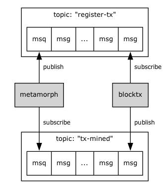

<div align="center">

# Authoritative Response Component (ARC)

[](https://golang.org/)
[](https://github.com/bitcoin-sv/arc/releases)
[](https://goreportcard.com/report/github.com/bitcoin-sv/arc)
[](Makefile)
<br>
[](https://sonarcloud.io/summary/new_code?id=bitcoin-sv_arc)
[](https://sonarcloud.io/summary/new_code?id=bitcoin-sv_arc)
[](https://sonarcloud.io/summary/new_code?id=bitcoin-sv_arc)
<br>
[](https://sonarcloud.io/summary/new_code?id=bitcoin-sv_arc)
[](https://sonarcloud.io/summary/new_code?id=bitcoin-sv_arc)
[](https://sonarcloud.io/summary/new_code?id=bitcoin-sv_arc)
<br/>

</div>

ARC is a transaction processor for Bitcoin that keeps track of the life cycle of a transaction as it is processed by the Bitcoin network. Next to the mining status of a transaction, ARC also keeps track of the various states that a transaction can be in.

## Table of Contents
- [Authoritative Response Component (ARC)](#authoritative-response-component-arc)
  - [Table of Contents](#table-of-contents)
  - [Documentation](#documentation)
  - [Configuration](#configuration)
  - [How to run ARC](#how-to-run-arc)
    - [Docker](#docker)
  - [Microservices](#microservices)
    - [API](#api)
      - [Integration into an echo server](#integration-into-an-echo-server)
    - [Metamorph](#metamorph)
      - [Metamorph transaction statuses](#metamorph-transaction-statuses)
      - [Metamorph stores](#metamorph-stores)
      - [Connections to Bitcoin nodes](#connections-to-bitcoin-nodes)
      - [Whitelisting](#whitelisting)
      - [ZMQ](#zmq)
    - [BlockTx](#blocktx)
      - [BlockTx stores](#blocktx-stores)
    - [Callbacker](#callbacker)
      - [Callbacker stores](#callbacker-stores)
  - [K8s-Watcher](#k8s-watcher)
  - [Message Queue](#message-queue)
  - [Broadcaster-cli](#broadcaster-cli)
  - [Tests](#tests)
    - [Unit tests](#unit-tests)
    - [Integration tests](#integration-tests)
    - [E2E tests](#e2e-tests)
  - [Monitoring](#monitoring)
    - [Prometheus](#prometheus)
    - [Profiler](#profiler)
    - [Tracing](#tracing)
  - [Building ARC](#building-arc)
    - [Generate grpc code](#generate-grpc-code)
    - [Generate REST API](#generate-rest-api)
    - [Generate REST API documentation](#generate-rest-api-documentation)
  - [Acknowledgements](#acknowledgements)
  - [Contribution Guidelines](#contribution-guidelines)
  - [Support \& Contacts](#support--contacts)

## Documentation

- Find full documentation at [https://bitcoin-sv.github.io/arc](https://bitcoin-sv.github.io/arc)

## Configuration

Settings for ARC are defined in a configuration file. The default configuration is shown in [config/example_config.yaml](./config/example_config.yaml). Each setting is documented in the file itself.
If you want to load `config.yaml` from a different location, you can specify it on the command line using the `-config=<path>` flag.

Arc also has a default configuration specified in code ([config/defaults.go](./config/defaults.go)), therefore, in your `config.yaml` you can specify only the values that you want override. Example:
```yaml
---
logLevel: INFO
logFormat: text
network: mainnet
tracing:
  dialAddr: http://tracing:1234
```
The rest of the settings will be taken from defaults.

Each setting in the file `config.yaml` can be overridden with an environment variable. The environment variable needs to have this prefix `ARC_`. A sub setting will be separated using an underscore character. For example the following config setting could be overridden by the environment variable `ARC_METAMORPH_LISTENADDR`
```yaml
metamorph:
  listenAddr:
```

## How to run ARC

To run all the microservices in one process (during development), use the `main.go` file in the root directory.

```shell
go run cmd/arc/main.go
```

The `main.go` file accepts the following flags (`main.go --help`):

```shell
usage: main [options]
where options are:

    -api=<true|false>
          whether to start ARC api server (default=true)

    -metamorph=<true|false>
          whether to start metamorph (default=true)

    -blocktx=<true|false>
          whether to start block tx (default=true)

    -k8s-watcher=<true|false>
          whether to start k8s-watcher (default=true)

    -callbacker=<true|false>
          whether to start callbacker (default=true)

    -config=/location
          directory to look for config (default='')

    -dump_config=/file.yaml
          dump config to specified file and exit (default='config/dumped_config.yaml')
```

Each individual microservice can also be started individually by running e.g. `go run cmd/arc/main.go -api=true`.
NOTE: If you start the `main.go` with a microservice set to true, it will not start the other services. For example, if
you run `go run cmd/arc/main.go -api=true`, it will only start the API server, and not the other services, although you can start multiple services by specifying them on the command line.

In order to run ARC there needs to be a Postgres database available. The connection to the database is defined in the `config.yaml` file. The database needs to be created before running ARC. The migrations for the database can be found in the `internal/metamorph/store/postgresql/migrations` folder. The migrations can be executed using the [go-migrate](https://github.com/golang-migrate/migrate) tool (see section [Metamorph stores](#metamorph-stores), [Blocktx stores](#blocktx-stores) and [Callbacker stores](#callbacker-stores)).

Additionally, ARC relies on a message queue to communicate between Metamorph and BlockTx (see section [Message Queue](#message-queue)) section. The message queue can be started as a docker container. The docker image can be found [here](https://hub.docker.com/_/nats). The message queue can be started like this:

```
docker run -p 4222:4222 nats
```

You can run ARC with all components using the [docker-compose.yaml](./test/docker-compose.yaml) file by using the following make command
```
make run
```

### Docker
ARC can be run as a docker container. The docker image can be built using the provided `Dockerfile` (see section [Building ARC](#building-arc)).

The latest docker image of ARC can be found [here](https://hub.docker.com/r/bsvb/arc/).

## Microservices

The API http server as well as all gRPC servers of each service has dual-stack capability and thus listen on both IPv4 & IPv6 addresses.

### API

API is the REST API microservice for interacting with ARC. See the [API documentation](https://bitcoin-sv.github.io/arc/api.html) for more information.

The API takes care of authentication, validation, and sending transactions to Metamorph. The API talks to one or more Metamorph instances using client-based, round-robin load balancing.

To register a callback, the client must add the `X-CallbackUrl` header to the
request. The callbacker will then send a POST request to the URL specified in the header, with the transaction ID in
the body. See the [API documentation](https://bitcoin-sv.github.io/arc/api.html) for more information.

You can run the API like this:

```shell
go run cmd/arc/main.go -api=true
```

The only difference between the two is that the generic `main.go` starts the Go profiler, while the specific `cmd/api/main.go`
command does not.

#### Integration into an echo server

If you want to integrate the ARC API into an existing echo server, check out the
[examples](./examples) folder in the GitHub repo.

### Metamorph

Metamorph is a microservice that is responsible for processing transactions sent by the API to the Bitcoin network. It
takes care of re-sending transactions if they are not acknowledged by the network within a certain time period (60
seconds by default).

Metamorph is designed to be horizontally scalable, with each instance operating independently. As a result, they do not communicate with each other and remain unaware of each other's existence.

You can run metamorph like this:

```shell
go run cmd/arc/main.go -metamorph=true
```

#### Metamorph transaction statuses

Metamorph keeps track of the lifecycle of a transaction, and assigns it a status, which is returned in the `txStatus` field whenever the transaction is queried.
The following statuses are available:

| Status                   | Description                                                                                                                                                                                              |
|--------------------------|----------------------------------------------------------------------------------------------------------------------------------------------------------------------------------------------------------|
| `UNKNOWN`                | The transaction has been sent to metamorph, but no processing has taken place. This should never be the case, unless something goes wrong.                                                               |
| `QUEUED`                 | The transaction has been queued for processing.                                                                                                                                                          |
| `RECEIVED`               | The transaction has been properly received by the metamorph processor.                                                                                                                                   |
| `STORED`                 | The transaction has been stored in the metamorph store. This should ensure the transaction will be processed and retried if not picked up immediately by a mining node.                                  |
| `ANNOUNCED_TO_NETWORK`   | The transaction has been announced (INV message) to the Bitcoin network.                                                                                                                                 |
| `REQUESTED_BY_NETWORK`   | The transaction has been requested from metamorph by a Bitcoin node.                                                                                                                                     |
| `SENT_TO_NETWORK`        | The transaction has been sent to at least 1 Bitcoin node.                                                                                                                                                |
| `ACCEPTED_BY_NETWORK`    | The transaction has been accepted by a connected Bitcoin node on the ZMQ interface. If metamorph is not connected to ZMQ, this status will never by set.                                                 |
| `SEEN_IN_ORPHAN_MEMPOOL` | The transaction has been sent to at least 1 Bitcoin node but parent transaction was not found.                                                                                                           |
| `SEEN_ON_NETWORK`        | The transaction has been seen on the Bitcoin network and propagated to other nodes. This status is set when metamorph receives an INV message for the transaction from another node than it was sent to. |
| `DOUBLE_SPEND_ATTEMPTED` | The transaction is a double spend attempt. Competing transaction(s) will be returned with this status.                                                                                                   |
| `MINED_IN_STALE_BLOCK`   | The transaction has been mined into a block that became stale after a reorganisation of chain (reorg).                                                                                                   |
| `REJECTED`               | The transaction has been rejected by the Bitcoin network.                                                                                                                                                |
| `MINED`                  | The transaction has been mined into a block by a mining node.                                                                                                                                            |

The statuses have a difference between the codes in order to make it possible to add more statuses in between the existing ones without creating a breaking change.

#### Metamorph stores

Currently, Metamorph only offers one storage implementation which is Postgres.

Migrations have to be executed prior to starting Metamorph. For this you'll need the [go-migrate](https://github.com/golang-migrate/migrate) tool. Once `go-migrate` has been installed, the migrations can be executed as follows:
```bash
migrate -database "postgres://<username>:<password>@<host>:<port>/<db-name>?sslmode=<ssl-mode>"  -path internal/metamorph/store/postgresql/migrations  up
```

#### Connections to Bitcoin nodes

Metamorph can connect to multiple Bitcoin nodes, and will use a subset of the nodes to send transactions to. The other
nodes will be used to listen for transaction **INV** message, which will trigger the SEEN_ON_NETWORK status of a transaction.

The Bitcoin nodes can be configured in `config.yaml`.

#### Whitelisting

Metamorph is talking to the Bitcoin nodes over the p2p network. If metamorph sends invalid transactions to the
Bitcoin node, it will be **banned** by that node. Either make sure not to send invalid or double spend transactions through
metamorph, or make sure that all metamorph servers are **whitelisted** on the Bitcoin nodes they are connecting to.

#### ZMQ

Although not required, zmq can be used to listen for transaction messages (`hashtx`, `invalidtx`, `discardedfrommempool`).
This is especially useful if you are not connecting to multiple Bitcoin nodes, and therefore are not receiving INV
messages for your transactions. Currently, ARC can only detect whether a transaction was rejected e.g. due to double spending if ZMQ is connected to at least one node.

If you want to use zmq, you can set the `host.port.zmq` setting for the respective `peers` setting in the configuration file.

ZMQ does seem to be a bit faster than the p2p network, so it is recommended to turn it on, if available.

### BlockTx

BlockTx is a microservice that is responsible for processing blocks mined on the Bitcoin network, and for propagating
the status of transactions to Metamorph.

The main purpose of BlockTx is to de-duplicate processing of (large) blocks. As an incoming block is processed by BlockTx, each Metamorph is notified of transactions that they have registered an interest in.  BlockTx does not store the transaction data, but instead stores only the transaction IDs and the block height in which
they were mined. Metamorph is responsible for storing the transaction data.

You can run BlockTx like this:

```shell
go run cmd/arc/main.go -blocktx=true
```

#### BlockTx stores

Currently, BlockTx only offers one storage implementation which is Postgres.

Migrations have to be executed prior to starting BlockTx. For this you'll need the [go-migrate](https://github.com/golang-migrate/migrate) tool. Once `go-migrate` has been installed, the migrations can be executed as follows:
```bash
migrate -database "postgres://<username>:<password>@<host>:<port>/<db-name>?sslmode=<ssl-mode>"  -path internal/blocktx/store/postgresql/migrations  up
```

### Callbacker

Callbacker is a microservice that sends callbacks to a specified URL.

Callbacker is designed to be horizontally scalable, with each instance operating independently. As a result, they do not communicate with each other and remain unaware of each other's existence.

Callbacker receives messages from Metamorph over a NATS [message queue](#message-queue). Therefore, Callbacker requires the [message queue](#message-queue) to run together with ARC in order to function.

You can run Callbacker like this:

```shell
go run cmd/arc/main.go -callbacker=true
```

#### Callbacker stores

Currently, Callbacker only offers one storage implementation which is Postgres.

Migrations have to be executed prior to starting Callbacker. For this you'll need the [go-migrate](https://github.com/golang-migrate/migrate) tool. Once `go-migrate` has been installed, the migrations can be executed as follows:
```bash
migrate -database "postgres://<username>:<password>@<host>:<port>/<db-name>?sslmode=<ssl-mode>"  -path internal/callbacker/store/postgresql/migrations  up
```

## K8s-Watcher

If ARC runs on a Kubernetes cluster, then the K8s-Watcher can be run as a safety measure in case that graceful shutdown was not successful. K8s-watcher keeps an up-to-date list of `callbacker` and `metamorph` pods. It sends this list in intervals to each of the service using the `UpdateInstances` rpc call. Both `callbacker` and `metamorph` run any remaining cleanup procedures.

The K8s-Watcher can be started as follows

```shell
go run cmd/arc/main.go -k8s-watcher=true
```

## Message Queue

For the asynchronous communication between services a message queue is used. Currently, the only available implementation of that message queue uses [NATS](https://nats.io/). A message queue of this type has to run in order for ARC to run. If for any reason the connection to the NATS server is closed after all reconnection attempts, ARC will shut down automatically.

One instance where the message queue is used is the communication between Metamorph & Blocktx service. Metamorph publishes new transactions to the message queue and BlockTx subscribes to the message queue, receive the transactions and stores them. Once BlockTx finds these transactions have been mined in a block it updates the block information and publishes the block information to the message queue. Metamorph subscribes to the message queue and receives the block information and updates the status of the transactions.



## Broadcaster-cli

Please see [README.md](./cmd/broadcaster-cli/README.md) for more details

## Tests
### Unit tests

In order to run the unit tests do the following
```
make test
```

### Integration tests

Integration tests of the postgres database need docker installed to run them. If `colima` implementation of Docker is being used on macOS, the `DOCKER_HOST` environment variable may need to be given as follows
```bash
DOCKER_HOST=unix:///Users/<username>/.colima/default/docker.sock make test
```
These integration tests can be excluded from execution with `go test ./...` by adding the `-short` flag like this `go test -short ./...`.

### E2E tests

The end-to-end tests are located in the folder `test`. Docker needs to be installed in order to run them. End-to-end tests can be run locally together with arc, 3 nodes and all other external services like databases using the provided docker-compose file.
The tests can be executed like this:
```
make run_e2e_tests
```

The [docker-compose](./docker-compose.yaml) file also shows the minimum setup that is needed for ARC to run.

## Monitoring

### Prometheus

Prometheus can collect ARC metrics. It improves observability in production and enables debugging during development and deployment. As Prometheus is a very standard tool for monitoring, any other complementary tool such as Grafana and others can be added for better data analysis.

Prometheus periodically polls the system data by querying specific urls.

ARC can expose a Prometheus endpoint that can be used to monitor the servers. Set the `prometheusEndpoint` setting in the settings file to activate prometheus. Normally you would want to set this to `/metrics`.

The Prometheus endpoint can be configured in `config.yaml`:

```yaml
prometheus:
  enabled: false # if true, then prometheus metrics are enabled
  endpoint: /metrics # endpoint for prometheus metrics
  addr: :2112 # port for serving prometheus metrics
```

### Profiler

Each service runs a http profiler server if it is configured in `config.yaml`. In order to access it, a connection can be created using the Go `pprof` [tool](https://pkg.go.dev/net/http/pprof). For example to investigate the memory usage
```bash
go tool pprof http://localhost:9999/debug/pprof/allocs
```
Then type `top` to see the functions which consume the most memory. Find more information [here](https://go.dev/blog/pprof).

### Tracing

Currently, the traces are exported only in [open telemtry protocol (OTLP)](https://opentelemetry.io/docs/specs/otel/protocol/) on the gRPC endpoint. This endpoint URL of the receiving tracing backend (e.g. [Jaeger](https://www.jaegertracing.io/), [Grafana Tempo](https://grafana.com/oss/tempo/), etc.) can be configured with the respective `tracing.dialAddr` setting.

Tracing can be configured in `config.yaml`:

```yaml
  tracing:
    enabled: true # is tracing enabled
    dialAddr: http://localhost:4317 # address where traces are exported to
    sample: 100 # percentage of the sampling
```

## Building ARC

For building the ARC binary, there is a make target available. ARC can be built for Linux OS and amd64 architecture using

```
make build_release
```

Once this is done additionally a docker image can be built using

```
make build_docker
```

### Generate grpc code

GRPC code are generated from protobuf definitions. In order to generate the necessary tools need to be installed first by running
```
make install_gen
```
Additionally, [protoc](https://grpc.io/docs/protoc-installation/) needs to be installed.

Once that is done, GRPC code can be generated by running
```
make gen
```

### Generate REST API

The rest api is defined in a [yaml file](./pkg/api/arc.yaml) following the OpenAPI 3.0.0 specification. Before the rest API can be generated install the necessary tools by running
```
make install_gen
```
Once that is done, the API code can be generated by running
```
make api
```

### Generate REST API documentation
Before the documentation can be generated [swagger-cli](https://apitools.dev/swagger-cli/) and [widdershins](https://github.com/Mermade/widdershins) need to be installed.

Once that is done the documentation can be created by running
```
make docs
```

## Acknowledgements
Special thanks to [rloadd](https://github.com/rloadd/) for his inputs to the documentation of ARC.

## Contribution Guidelines

We're always looking for contributors to help us improve the project. Whether it's bug reports, feature requests, or pull requests - all contributions are welcome.

1. **Fork & Clone**: Fork this repository and clone it to your local machine.
2. **Set Up**: Run `make deps` to install all dependencies.
3. **Make Changes**: Create a new branch and make your changes.
4. **Test**: Ensure all tests pass by running `make test` and `make run_e2e_tests`.
5. **Commit**: Commit your changes and push to your fork.
6. **Pull Request**: Open a pull request from your fork to this repository.

For more details, check the [contribution guidelines](./CONTRIBUTING.md).

For information on past releases, check out the [changelog](./CHANGELOG.md).

## Support & Contacts

For questions, bug reports, or feature requests, please open an issue on GitHub.
