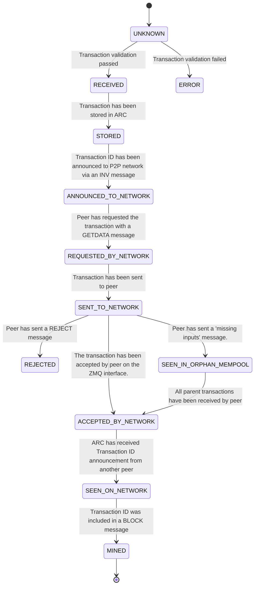
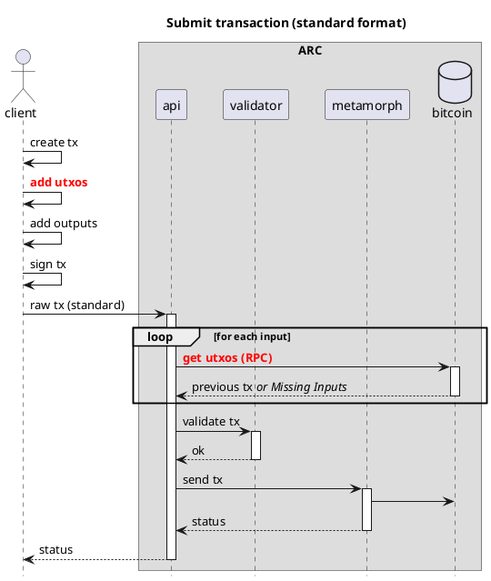
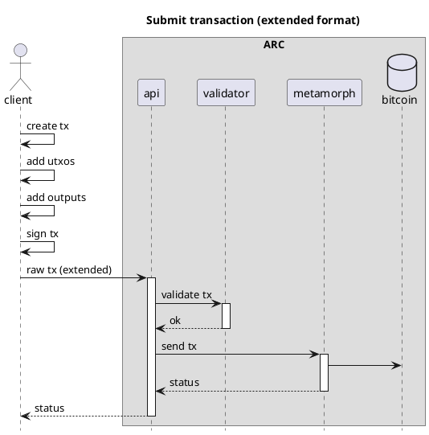
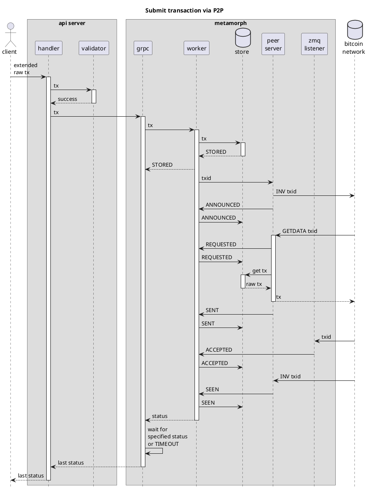
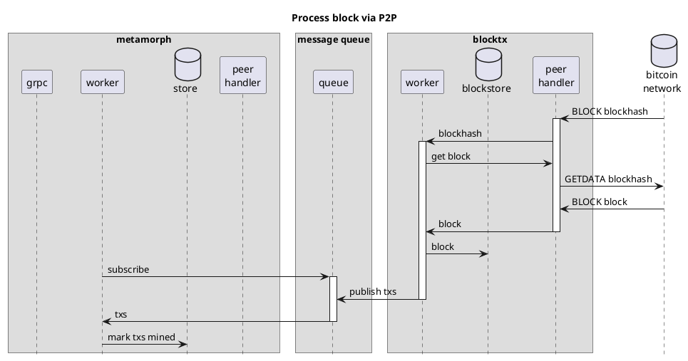

# ARC
> Transaction processor for Bitcoin

## Overview

**ARC** is a multi-layer transaction processor for Bitcoin that keeps track of the life cycle of a transaction as it is processed by the Bitcoin network. Next to the mining status of a transaction, ARC also keeps track of the various states that a
transaction can be in, such as `ANNOUNCED_TO_NETWORK`, `SEEN_IN_ORPHAN_MEMPOOL`, `SENT_TO_NETWORK`, `SEEN_ON_NETWORK`, `MINED`, `REJECTED`, etc.

Unlike other transaction processors, ARC broadcasts all transactions on the p2p network, and does not rely on the rpc interface of a single Bitcoin node. This makes it possible for ARC to connect and broadcast to any number of nodes, as many as are desired. In the future, ARC will be also able to send transactions using ipv6 multicast, which will make it
possible to connect to a large number of nodes without incurring large bandwidth costs.

The ARC design decouples the core functions of a transaction processor and encapsulates them as microservices with the ability to scale horizontally adaptively. Interaction between microservices is decoupled using asynchronous messaging where possible.

ARC consists of 3 core microservices: [API](#API), [Metamorph](#Metamorph) and [BlockTx](#BlockTx), which are all described below.

All the microservices are designed to be horizontally scalable, and can be deployed on a single machine or on multiple machines. Each one has been programmed with a store interface. The default store is postgres, but any database that implements the store interface can be used.


## Transaction lifecycle

The ARC architecture has been designed to assist in the management of the transaction lifecycle, enabling better tracking of the status of each transaction, reissuing transactions until they are seen by the network and notifying the issuer of relevant status changes. This ARC feature allows clients and bitcoin wallets to be lighter and more efficient in their mission.

ARC is a transaction processor for Bitcoin that keeps track of the life cycle of a transaction as it is processed by the Bitcoin network. Next to the mining status of a transaction, ARC also keeps track of the various states that a transaction can be in, such as `ANNOUNCED_TO_NETWORK`, `SEEN_IN_ORPHAN_MEMPOOL`, `SENT_TO_NETWORK`, `SEEN_ON_NETWORK`, `MINED`, `REJECTED`, etc.

If a transaction is not `SEEN_ON_NETWORK` within a certain time period (60 seconds by default), ARC will re-send the transaction to the Bitcoin network. ARC also monitors the Bitcoin network for transaction and block messages, and will notify the client when a transaction has been mined, or rejected.


## Microservices

### API

API is the REST API microservice for interacting with ARC. See the [API documentation](api.html) for more information.

The API takes care of validation and sending transactions to Metamorph. The API talks to one or more Metamorph instances using client-based, round robin load balancing.

#### Validation

The API is the first component of ARC and therefore the one that by design derives a benefit for ARC performing a preliminar validation of transactions thanks to the use of the [extended transaction format](#extended-format).

However, sending transactions in classic format is supported through the ARC API.

When possible, the API is responsible for rejecting transactions that would be unacceptable to the Bitcoin network.

### Metamorph

Metamorph is a microservice that is responsible for processing transactions sent by the API to the Bitcoin network. It takes care of re-sending transactions if they are not acknowledged by the network within a certain time period (60 seconds by default).

#### Callbacks

Metamorph also can send callbacks to a specified URL. To register a callback, the client must add the `X-CallbackUrl` header to the request. The callbacker will then send a POST request to the URL specified in the header, with the transaction ID in the body.

The following example shows the format of a callback body

```json
{
  "blockHash": "0000000000000000064cbaac5cedf71a5447771573ba585501952c023873817b",
  "blockHeight": 837394,
  "extraInfo": null,
  "merklePath": "fe12c70c000c020a008d1c719355d718dad0ccc...",
  "timestamp": "2024-03-26T16:02:29.655390092Z",
  "txStatus": "MINED",
  "txid": "48ccf56b16ec11ddd9cfafc4f28492fb7e989d58594a0acd150a1592570ccd13"
}
```
By default, callbacks are sent to the specified URL in case the submitted transaction has status `REJECTED` or `MINED`. In case the client wants to receive the intermediate status updates (`SEEN_IN_ORPHAN_MEMPOOL` and `SEEN_ON_NETWORK`) about the transaction, additionally the `X-FullStatusUpdates` header needs to be set to `true`. See the [API documentation](api.html) for more information.
`X-MaxTimeout` header determines maximum number of seconds to wait for transaction new statuses before request expires (default 5sec, max value 30s).

### BlockTx

BlockTx is a microservice that is responsible for processing blocks mined on the Bitcoin network, and for propagating
the status of transactions to each Metamorph that has subscribed to this service.

The main purpose of BlockTx is to de-duplicate processing of (large) blocks. As an incoming block is processed by BlockTx, Metamorph is notified about mined transactions by means of a message queue.  BlockTx does not store the transaction data, but instead stores only the transaction IDs and the block height in which they were mined. Metamorph is responsible for storing the transaction data.

## Extended format

For optimal performance, ARC uses a custom format for transactions. This format is called the extended format, and is a superset of the raw transaction format. The extended format includes the satoshis and scriptPubKey for each input, which makes it possible for ARC to validate the transaction without having to download the parent transactions. In most cases the sender already has all the information from the parent transaction, as this is needed to sign the transaction.

The only check that cannot be done on a transaction in the extended format is the check for double spends. This can only be done by downloading the parent transactions, or by querying a utxo store. A robust utxo store is still in development and will be added to ARC when it is ready. At this moment, the utxo check is performed in the Bitcoin node when a transaction is sent to the network.

### Extended format efficiency

With the successful adoption of Bitcoin ARC, this format should establish itself as the new standard of interchange
between wallets and non-mining nodes on the network.

The extended format has been described in detail in [BIP-239](BIP-239).

The following diagrams show the difference between validating a transaction in the standard and extended format:

#### Standard format flow


For each request ARC receives in standard format, it must request the utxos from the Bitcoin node. This is a slow process, as it requires a round trip to the Bitcoin node for each input.

For this reason it is expected that transactions come in an extended format. Transactions in standard format requires a pretreatment to convert each tx into one in extended format to pass through the ARC pipeline.

That pretreatment detracts from the expected efficiency of the process because it requires extra requests to the Bitcoin network. Therefore, it is expected that the trend will be to use the extended format, which may be the only one supported in the future.


#### Extended format flow


In contrast, the extended format allows the API to perform a preliminary validation and rule out malformed transactions by reviewing the transaction data provided in the extended fashion. Obviously, double spending (for example) cannot be checked without an updated utxo set and it is assumed that the API does not have this data. Therefore, the "validator" subfunction within the API filters as much as it can to reduce spurious transactions passing through the pipeline but leaves others for the bitcoin nodes themselves.


This [validation](#validation) takes place in the ARC API microservice. The actual utxos are left to be checked by the Bitcoin node itself, like it would do anyway, regardless of where the transaction is coming from. With this process flow we save the node from having to lookup and send the input utxos to the ARC API, which could be slow under heavy load.

## Settings

The settings available for running ARC are managed by [viper](github.com/spf13/viper). The settings are by default defined in `config.yaml`.

## ARC stats

ARC can expose a Prometheus endpoint that can be used to monitor the metamorph servers. Set the `prometheusEndpoint`
setting in the settings file to activate prometheus. Normally you would want to set this to `/metrics`.

## Client Libraries

### Typescript

A typescript library is available in the [@bsv/sdk](https://github.com/bitcoin-sv/ts-sdk) repository.

Please note that [arc-client-js](https://github.com/bitcoin-sv/arc-client-js) is deprecated.

## Process flow diagrams




