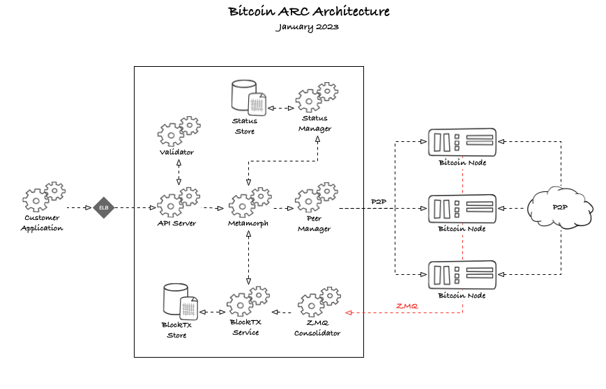
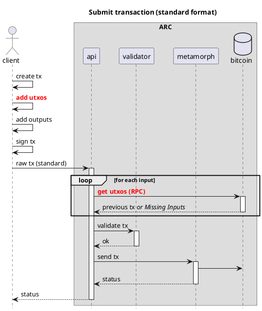
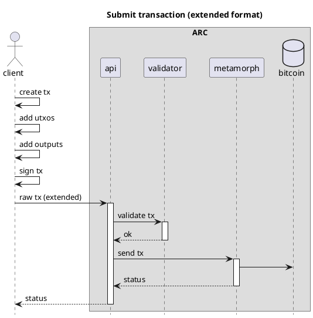
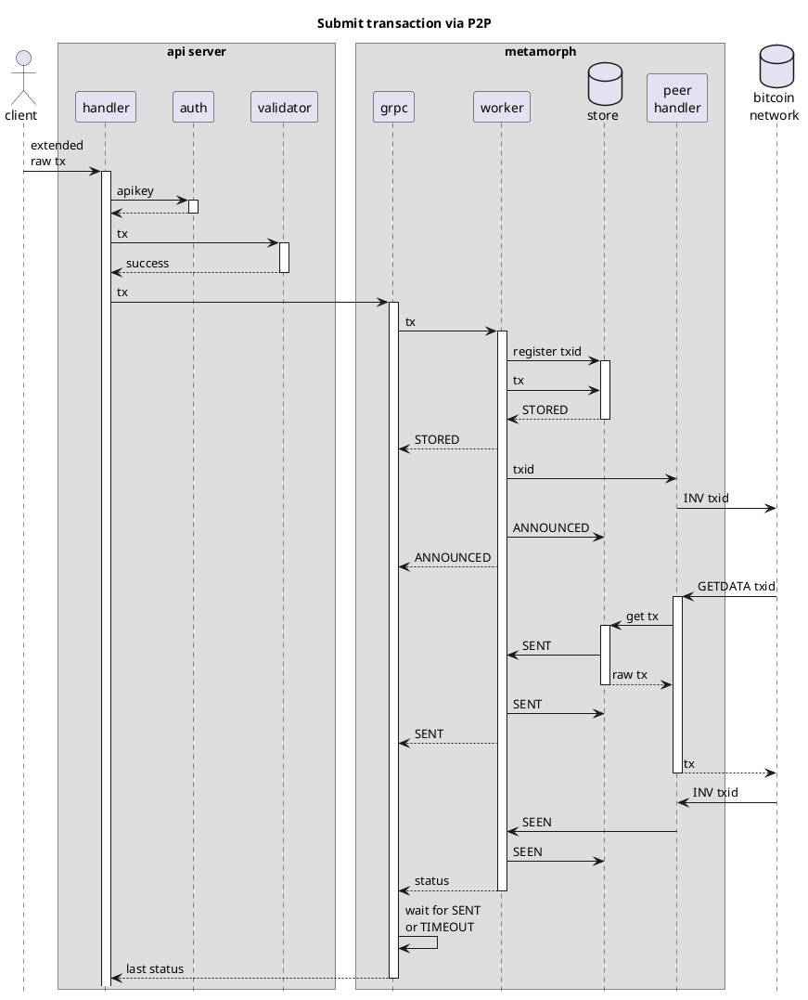
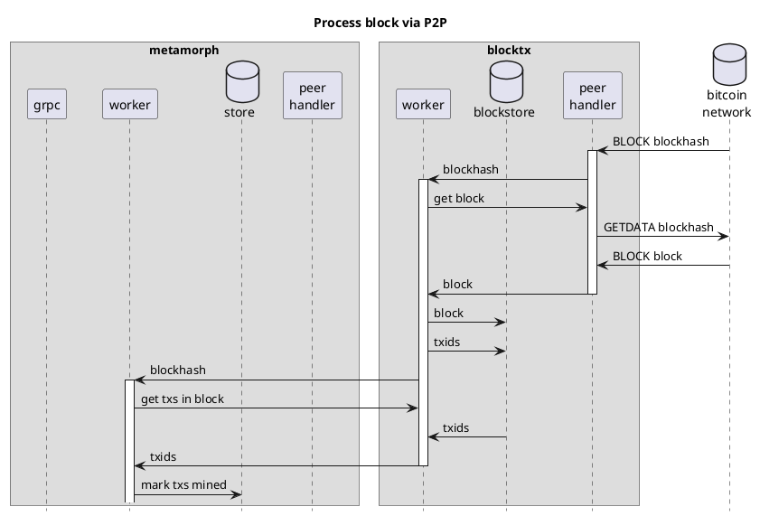

# ARC
> Transaction processor for Bitcoin

## Overview

ARC is a transaction processor for Bitcoin that keeps track of the life cycle of a transaction as it is processed by
the Bitcoin network. Next to the mining status of a transaction, ARC also keeps track of the various states that a
transaction can be in, such as `ANNOUNCED_TO_NETWORK`, `SENT_TO_NETWORK`, `SEEN_ON_NETWORK`, `MINED`, `REJECTED`, etc.

If a transaction is not `SEEN_ON_NETWORK` within a certain time period (60 seconds by default), ARC will re-send the
transaction to the Bitcoin network. ARC also monitors the Bitcoin network for transaction and block messages, and
will notify the client when a transaction has been mined, or rejected.

Unlike other transaction processors, ARC broadcasts all transactions on the p2p network, and does not rely on the rpc
interface of a Bitcoin node. This makes it possible for ARC to connect and broadcast to any number of nodes, as many
as are desired. In the future, ARC will be also able to send transactions using ipv6 multicast, which will make it
possible to connect to a large number of nodes without incurring large bandwidth costs.

ARC consists of four microservices: [API](#API), [Metamorph](#Metamorph), [BlockTx](#BlockTx) and [Callbacker](#Callbacker), which are all described below.

All the microservices are designed to be horizontally scalable, and can be deployed on a single machine or on multiple machines. Each one has been programmed with a store interface and various databases can be used to store data. The default store is sqlite3, but any database that implements the store interface can be used.



### API

API is the REST API microservice for interacting with ARC. See the [API documentation](/arc/api.html) for more information.

The API takes care of authentication, validation, and sending transactions to Metamorph.  The API talks to one or more Metamorph instances using client-based, round robin load balancing.

### Metamorph

Metamorph is a microservice that is responsible for processing transactions sent by the API to the Bitcoin network. It
takes care of re-sending transactions if they are not acknowledged by the network within a certain time period (60
seconds by default).

Metamorph is designed to be horizontally scalable, with each instance operating independently and having its own
transaction store. As a result, the metamorphs do not communicate with each other and remain unaware of each other's existence.

### BlockTx

BlockTx is a microservice that is responsible for processing blocks mined on the Bitcoin network, and for propagating
the status of transactions to each Metamorph that has subscribed to this service.

The main purpose of BlockTx is to de-duplicate processing of (large) blocks. As an incoming block is processed by BlockTx, each Metamorph is notified of transactions that they have registered an interest in.  BlockTx does not store the transaction data, but instead stores only the transaction IDs and the block height in which
they were mined. Metamorph is responsible for storing the transaction data.

### Callbacker

Callbacker is a very simple microservice that is responsible for sending callbacks to clients when a transaction has
been accepted by the Bitcoin network. To register a callback, the client must add the `X-CallbackUrl` header to the
request. The callbacker will then send a POST request to the URL specified in the header, with the transaction ID in
the body. See the [API documentation](/arc/api.html) for more information.

## Extended format

For optimal performance, ARC uses a custom format for transactions. This format is called the extended format, and is a
superset of the raw transaction format. The extended format includes the satoshis and scriptPubKey for each input,
which makes it possible for ARC to validate the transaction without having to download the parent transactions. In most
cases the sender already has all the information from the parent transaction, as this is needed to sign the transaction.

The only check that cannot be done on a transaction in the extended format is the check for double spends. This can
only be done by downloading the parent transactions, or by querying a utxo store. A robust utxo store is still in
development and will be added to ARC when it is ready. At this moment, the utxo check is performed in the Bitcoin
node when a transaction is sent to the network.

With the successful adoption of Bitcoin ARC, this format should establish itself as the new standard of interchange
between wallets and non-mining nodes on the network.

The extended format has been described in detail in [BIP-239](BIP-239).

The following diagrams show the difference between validating a transaction in the standard and extended format:





As you can see, the extended format is much more efficient, as it does not require any RPC calls to the Bitcoin node.

This validation takes place in the ARC API microservice. The actual utxos are left to be checked by the Bitcoin node
itself, like it would do anyway, regardless of where the transactions is coming from. With this process flow we save
the node from having to lookup and send the input utxos to the ARC API, which could be slow under heavy load.

## Settings

The settings available for running ARC are managed by [viper](github.com/spf13/viper). The settings are by default defined in `config.yaml`.

## ARC stats

`gocore` keeps real-time stats about the metamorph servers, which can be viewed at `/stats` (e.g. `http://localhost:8011/stats`).
These stats show aggregated information about a metamorph server, such as the number of transactions processed, the number of
transactions sent to the Bitcoin network, etc. It also shows the average time it takes for each step in the process.

More detailed statistics are available at `/pstats` (e.g. `http://localhost:8011/pstats`). These stats show information
about the internal metamorph processor. The processor stats also allows you to see details for a single transaction. If
a transaction has already been mined, and evicted from the processor memory, you can still see the stored stats
retrieved from the data store, and potentially the timing stats, if they are found in the log file.

ARC can also expose a Prometheus endpoint that can be used to monitor the metamorph servers. Set the `prometheusEndpoint`
setting in the settings file to activate prometheus. Normally you would want to set this to `/metrics`.

## Client Libraries

### Javascript

A typescript library is available in the [arc-client](https://github.com/bitcoin-sv/arc-client-js) repository.

Example usage:

```javascript
import { ArcClient } from '@bitcoin-a/arc-client';

const arcClient = new ArcClient({
  host: 'localhost',
  port: 8080,
  authorization: '<api-key>'
});

const txid = 'd4b0e1b0c0b0c0b0c0b0c0b0c0b0c0b0c0b0c0b0c0b0c0b0c0b0c0b0c0b0c0b0';
const result = await arcClient.getTransactionStatus(txid);
```

See the repository for more information.

## Process flow diagrams




