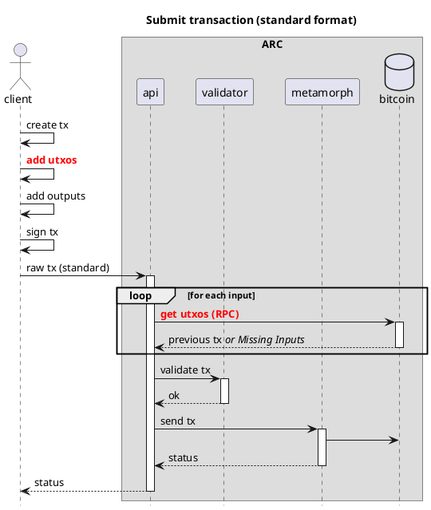
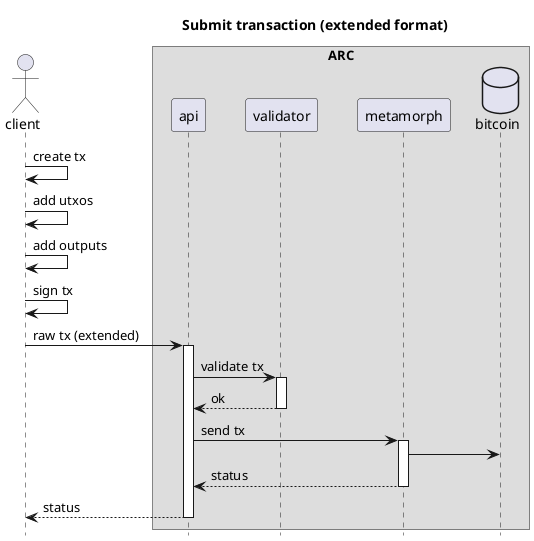
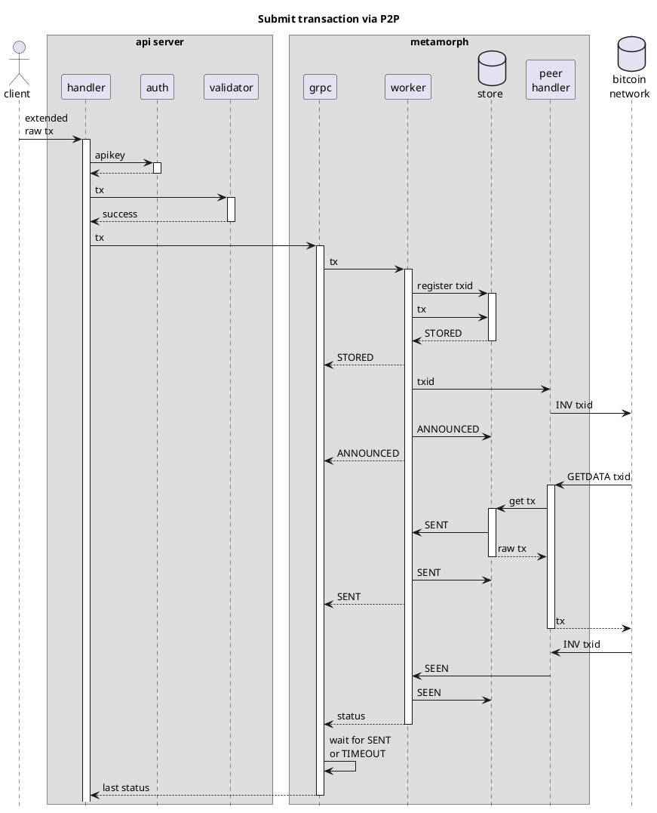
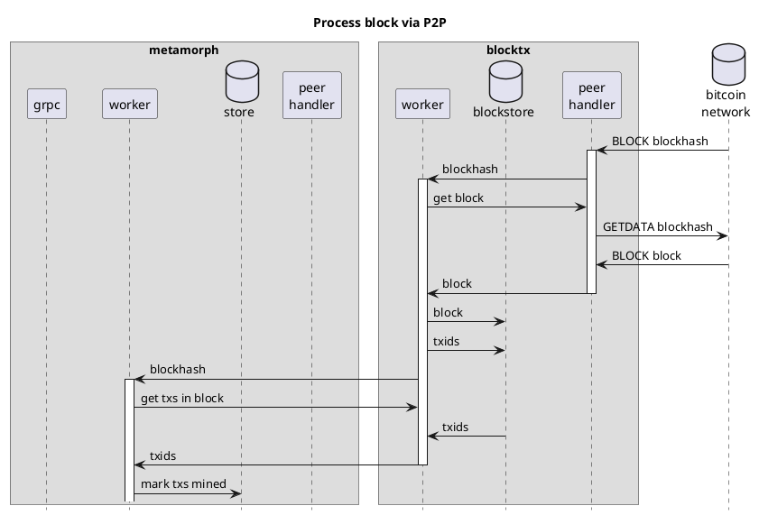

# ARC
> Transaction processor for Bitcoin

## Overview

ARC is a transaction processor for Bitcoin. It consists of four microservices: [API](#API), [Metamorph](#Metamorph), [BlockTx](#BlockTx) and [Callbacker](#Callbacker), which are all described below.

All the microservices are written in Go, and use grpc and protobufs for internal communications.

All the microservices are designed to be horizontally scalable, and can be deployed on a single machine or on multiple machines. Each one has been programmed with a store interface and various databases can be used to store data. The default store is sqlite3, but any database that implements the store interface can be used.

## Extended format

For optimal performance, ARC uses a custom format for transactions. This format is called the extended format, and is a
superset of the raw transaction format. The extended format includes the satoshis and scriptPubKey for each input, 
which makes it possible to validate the transaction without having to download the parent transactions. In most cases
the sender already has all the information from the parent transaction, as this is needed to sign the transaction.

The extended format has been described in detail in [BIP-239](BIP-239).





## Microservices

To run all the microservices in one process (during development), use the `main.go` file in the root directory.

```shell
go run main.go
```

The `main.go` file accepts the following flags (`main.go --help`):

```shell
usage: main [options]
where options are:

    -api=<true|false>
          whether to start ARC api server (default=true)

    -metamorph=<true|false>
          whether to start metamorph (default=true)

    -blocktx=<true|false>
          whether to start block tx (default=true)

    -callbacker=<true|false>
          whether to start callbacker (default=true)

    -tracer=<true|false>
          whether to start the Jaeger tracer (default=false)
```

NOTE: If you start the `main.go` with a microservice set to true, it will not start the other services. For example, if
you run `go run main.go -api=true`, it will only start the API server, and not the other services.

### API

API is the REST API microservice for interacting with ARC. See the [API documentation](api) for more information.

The API takes care of authentication, validation, and sending transactions to Metamorphs.

You can run the API like this:

```shell
go run cmd/api/main.go
```

or using the generic `main.go`:

```shell
go run main.go -api=true
```

The only difference between the two is that the generic `main.go` starts the Go profiler, while the specific `cmd/api/main.go` 
command does not.

#### Integration into an echo server

If you want to integrate the ARC API into an existing echo server, check out the 
[`examples`](https://github.com/TAAL-GmbH/arc/tree/master/examples) folder in the GitHub repo.

A very simple example:

```go
package main

import (
	"fmt"

	"github.com/TAAL-GmbH/arc/api"
	apiHandler "github.com/TAAL-GmbH/arc/api/handler"
	"github.com/TAAL-GmbH/arc/api/transactionHandler"
	"github.com/labstack/echo/v4"
)

func main() {

	// Set up a basic Echo router
	e := echo.New()

	// add a single bitcoin node
	txHandler, err := transactionHandler.NewBitcoinNode("localhost", 8332, "user", "mypassword", false)
	if err != nil {
		panic(err)
	}

	// initialise the arc default api handler, with our txHandler and any handler options
	var handler api.HandlerInterface
	if handler, err = apiHandler.NewDefault(txHandler); err != nil {
		panic(err)
	}

	// Register the ARC API
	// the arc handler registers routes under /v1/...
	api.RegisterHandlers(e, handler)
	// or with a base url => /mySubDir/v1/...
	// arc.RegisterHandlersWithBaseURL(e. blocktx_api, "/arc")

	// Serve HTTP until the world ends.
	e.Logger.Fatal(e.Start(fmt.Sprintf("%s:%d", "0.0.0.0", 8080)))
}
```

This will initialise the ARC API with a single Bitcoin node (not metamorph), similar to how MAPI is run at the moment.

### Metamorph

Metamorph is a microservice that is responsible for processing transactions sent by the API to the Bitcoin network. It
takes care of re-sending transactions if they are not acknowledged by the network within a certain time period (60
seconds by default).

Metamorphs are designed to be horizontally scalable, with each instance operating independently and having its own
transaction store. As a result, they do not communicate with each other and remain unaware of each other's existence.

You can run metamorph like this:

```shell
go run cmd/metamorph/main.go
```

or using the generic `main.go`:

```shell
go run main.go -metamorph=true
```

The only difference between the two is that the generic `main.go` starts the Go profiler, while the specific 
`cmd/metamorph/main.go` command does not.

#### Metamorph stores

The metamorph store has been implemented for multiple databases, depending on your needs. In high-volume environments,
you may want to use a database that is optimized for high throughput, such as [Badger](https://dgraph.io/docs/badger).

The following databases have been implemented:

* Sqlite3 (`sqlite` or `sqlite_memory` for in-memory)
* Postgres (`postgres`)
* Badger (`badger`)
* BadgerHold (`badgerhold`)

You can select the store to use by setting the `metamorph_dbMode` in the settings file or adding `metamorph_dbMode` as
an environment variable.

### BlockTx

BlockTx is a microservice that is responsible for processing blocks mined on the Bitcoin network, and for propagating
the status of transactions to all Metamorphs connected to the server.

The main purpose of BlockTx is to de-duplicate processing of (large) blocks. A block will be processed by BlockTx
and only sent once to all the connected metamorphs. The metamorphs have also registered which transactions they are
interested in with BlockTx, and BlockTx will only send the transactions that the metamorphs have registered.

BlockTx does not store the transaction data, but instead stores only the transaction IDs and the block height in which 
they were mined. The metamorphs are responsible for storing the transaction data.

You can run BlockTx like this:

```shell
go run cmd/blocktx/main.go
```

or using the generic `main.go`:

```shell
go run main.go -blocktx=true
```

The only difference between the two is that the generic `main.go` starts the Go profiler, while the specific
`cmd/blocktx/main.go`command does not.

#### BlockTx stores

The BlockTx store has been implemented for multiple databases, depending on your needs. In high-volume environments,
you may want to use a database that is optimized for high throughput, such as Postgres.

The following databases have been implemented:

* Sqlite3 (`sqlite` or `sqlite_memory` for in-memory)
* Postgres (`postgres`)

You can select the store to use by setting the `blocktx_dbMode` in the settings file or adding `blocktx_dbMode` as
an environment variable.

### Callbacker

Callbacker is a very simple microservice that is responsible for sending callbacks to clients when a transaction has
been accepted by the Bitcoin network. To register a callback, the client must add the `X-Callback-Url` header to the
request. The callbacker will then send a POST request to the URL specified in the header, with the transaction ID in
the body. See the [API documentation](#API) for more information.

## Settings

The settings available for running ARC are managed by [gocore](https://github.com/ordishs/gocore). The settings are
defined in 2 files `settings_local.conf`, in the root directory, and `settings.conf`, which lives a directory level
deeper. The settings in `settings.conf` override the settings in `settings_local.conf`.

`gocore` also accepts environment variables, which can be used to override the settings in the settings files. The
environment variable name is the same as the setting name. For example, the setting `metamorph_dbMode` can be
overridden by setting the environment variable `metamorph_dbMode=...`.

## ARC stats

* TODO: ARC exposes a Prometheus endpoint at `/metrics` that can be used to monitor the server.

`gocore` keeps real-time stats about the server, which can be viewed at `/stats` (e.g. `http://localhost:8011/stats`).
These stats show aggregated information about the server, such as the number of transactions processed, the number of
transactions sent to the Bitcoin network, etc. It also shows the average time it takes for each step in the process.

More detailed statistics are available at `/pstats` (e.g. `http://localhost:8011/pstats`). These stats show information
about the internal metamorph processor. The processor stats also allows you to see details for a single transaction,
which has not yet been mined. When a transaction is mined, the processor stats for that transaction are removed.

## Client Libraries

### Go

WIP

### Javascript

A typescript library is available in the [js-arc-client](https://github.com/TAAL-GmbH/js-arc-client) repository.

Example usage:

```javascript
import { ArcClient } from 'js-arc-client';

const arcClient = new ArcClient({
  host: 'localhost',
  port: 8080,
  apiKey: '<api-key>'
});

const txid = 'd4b0e1b0c0b0c0b0c0b0c0b0c0b0c0b0c0b0c0b0c0b0c0b0c0b0c0b0c0b0c0b0';
const result = await arcClient.getTransactionStatus(txid);
```

See the repository for more information.

## Process flow diagrams




