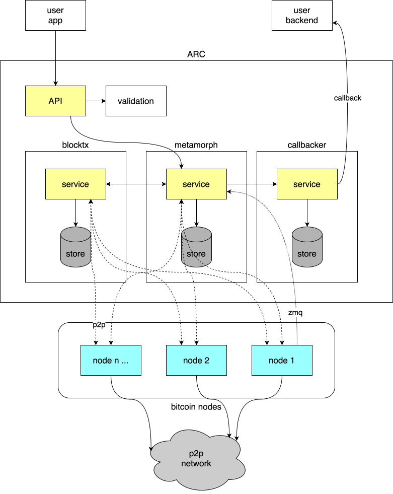
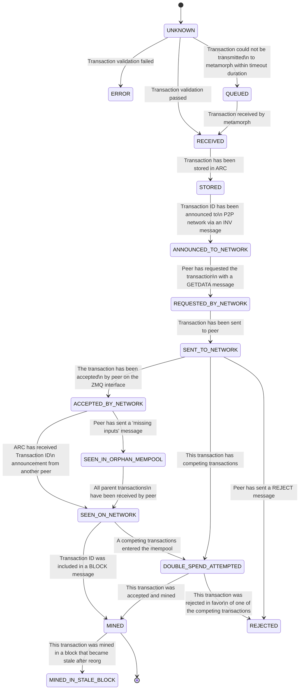
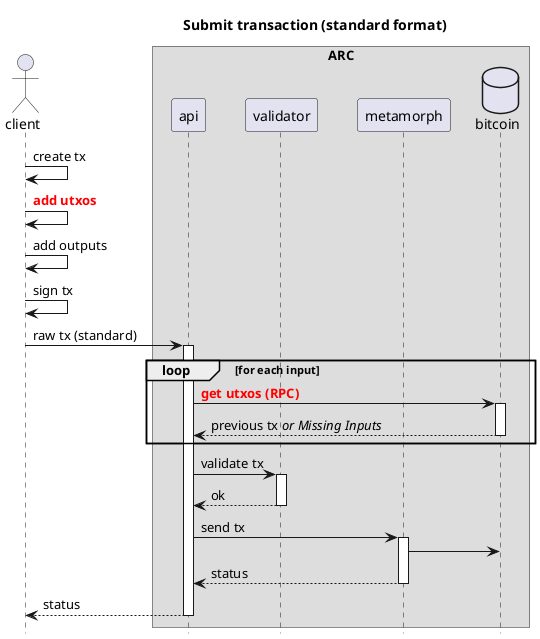
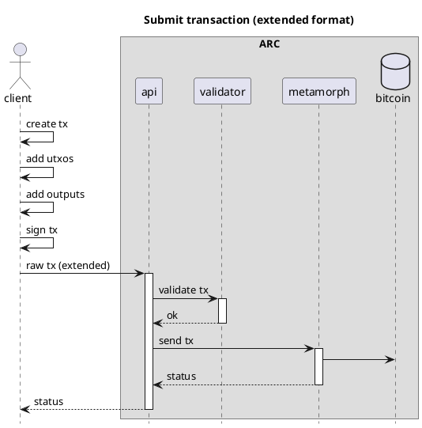
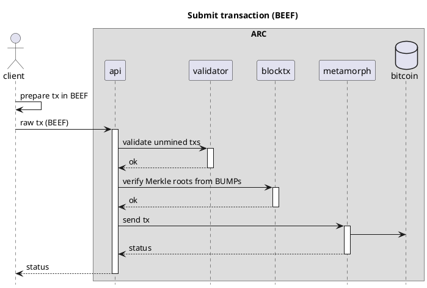
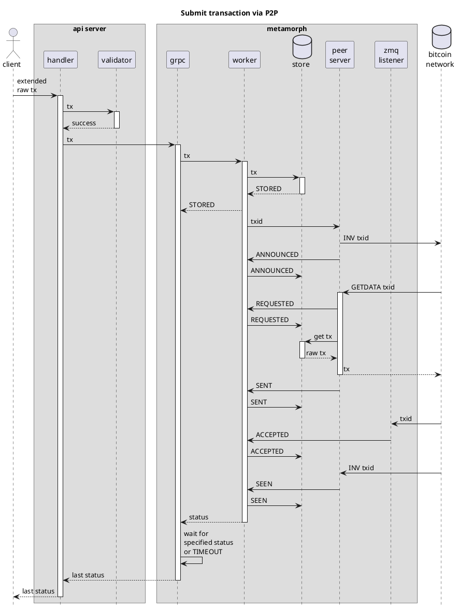
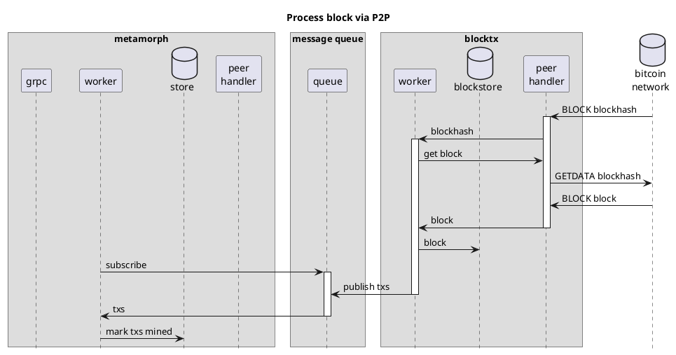
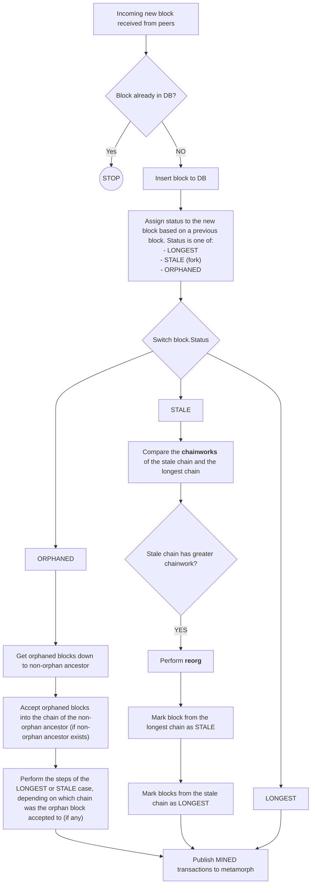

# **ARC** - Authoritative Response Component
> Transaction processor for Bitcoin

## Table of Contents
- [**ARC** - Authoritative Response Component](#arc---authoritative-response-component)
  - [Table of Contents](#table-of-contents)
  - [Overview](#overview)
  - [Transaction lifecycle](#transaction-lifecycle)
  - [Microservices](#microservices)
    - [API](#api)
      - [Validation](#validation)
      - [Callbacks](#callbacks)
    - [Metamorph](#metamorph)
    - [Callbacker](#callbacker)
    - [BlockTx](#blocktx)
  - [Extended Format (EF) and Background Evaluation Extended Format (BEEF)](#extended-format-ef-and-background-evaluation-extended-format-beef)
    - [Extended Formats efficiency](#extended-formats-efficiency)
      - [Standard format flow](#standard-format-flow)
      - [Extended format flow](#extended-format-flow)
      - [BEEF flow](#beef-flow)
  - [Settings](#settings)
  - [ARC stats](#arc-stats)
  - [Client Libraries](#client-libraries)
    - [Typescript](#typescript)
  - [Process flow diagrams](#process-flow-diagrams)
  - [Outcome in different scenarios](#outcome-in-different-scenarios)
    - [Double spending](#double-spending)
      - [Double Spend flow - Examples](#double-spend-flow---examples)
        - [Scenario 1](#scenario-1)
        - [Scenario 2](#scenario-2)
        - [Scenario 3](#scenario-3)
      - [Edge case](#edge-case)
    - [Multiple submissions to the same ARC instance](#multiple-submissions-to-the-same-arc-instance)
    - [Multiple submissions to ARC and other transaction processors](#multiple-submissions-to-arc-and-other-transaction-processors)
      - [Transaction has already been mined](#transaction-has-already-been-mined)
      - [Transaction has not yet been mined](#transaction-has-not-yet-been-mined)
    - [Chain reorg](#chain-reorg)
      - [Transaction in both chains](#transaction-in-both-chains)
      - [Transaction in the previously longest chain, but not in the stale chain that becomes longest](#transaction-in-the-previously-longest-chain-but-not-in-the-stale-chain-that-becomes-longest)
      - [Transaction in the stale chain only (without reorg)](#transaction-in-the-stale-chain-only-without-reorg)
      - [Summary table](#summary-table)
      - [Simplified flow diagram](#simplified-flow-diagram)
  - [Forcing validation](#forcing-validation)
  - [Cumulative fees validation](#cumulative-fees-validation)
    - [Usage](#usage)
      - [Special Cases](#special-cases)
    - [Validation Examples](#validation-examples)
      - [Example 1: Insufficient Fee Paid by One Ancestor](#example-1-insufficient-fee-paid-by-one-ancestor)
        - [Validation Result:](#validation-result)
      - [Example 2: All Transactions Paid Their Own Fees](#example-2-all-transactions-paid-their-own-fees)
        - [Validation Result:](#validation-result-1)
      - [Example 3: Ancestors Did Not Pay, But Transaction Covers All Fees](#example-3-ancestors-did-not-pay-but-transaction-covers-all-fees)
        - [Validation Result:](#validation-result-2)
    - [Notes](#notes)

## Overview

**ARC** is a multi-layer transaction processor for Bitcoin that keeps track of the life cycle of a transaction as it is processed by the Bitcoin network. Next to the mining status of a transaction, ARC also keeps track of the various states that a
transaction can be in, such as `ANNOUNCED_TO_NETWORK`, `SEEN_IN_ORPHAN_MEMPOOL`, `SENT_TO_NETWORK`, `SEEN_ON_NETWORK`, `MINED`, `REJECTED`, etc.

Unlike other transaction processors, ARC broadcasts all transactions on the p2p network, and does not rely on the rpc interface of a single Bitcoin node. This makes it possible for ARC to connect and broadcast to any number of nodes, as many as are desired. In the future, ARC will be also able to send transactions using ipv6 multicast, which will make it possible to connect to a large number of nodes without incurring large bandwidth costs.

The ARC design decouples the core functions of a transaction processor and encapsulates them as microservices with the ability to scale horizontally adaptively. Interaction between microservices is decoupled using asynchronous messaging where possible.

ARC consists of 4 core microservices: [API](#API), [Metamorph](#Metamorph), [Callbacker](#Callbacker) and [BlockTx](#BlockTx), which are all described below.

All the microservices are designed to be horizontally scalable, and can be deployed on a single machine or on multiple machines. Each one has been programmed with a store interface. The default store is postgres, but any database that implements the store interface can be used.



## Transaction lifecycle

The ARC architecture has been designed to assist in the management of the transaction lifecycle, enabling better tracking of the status of each transaction, reissuing transactions until they are seen by the network and notifying the issuer of relevant status changes. This ARC feature allows clients and bitcoin wallets to be lighter and more efficient in their mission.

ARC is a transaction processor for Bitcoin that keeps track of the life cycle of a transaction as it is processed by the Bitcoin network. Next to the mining status of a transaction, ARC also keeps track of the various states that a transaction can be in, such as `ANNOUNCED_TO_NETWORK`, `SEEN_IN_ORPHAN_MEMPOOL`, `SENT_TO_NETWORK`, `SEEN_ON_NETWORK`, `MINED`, `REJECTED`, etc.

If a transaction is not at least `SEEN_ON_NETWORK` within a certain time period (60 seconds by default), ARC will re-send the transaction to the Bitcoin network. ARC also monitors the Bitcoin network for transaction and block messages, and will notify the client when a transaction has been mined, or rejected.



## Microservices

### API

API is the REST API microservice for interacting with ARC. See the [API documentation](https://bitcoin-sv.github.io/arc/api.html) for more information.

The API takes care of validation and sending transactions to Metamorph. The API talks to one or more Metamorph instances using client-based, round-robin load balancing.

The `X-MaxTimeout` header determines the maximum number of seconds the system will wait for new transaction statuses before the response is returned. The default timeout is 5 seconds, with a maximum value of 30 seconds.

#### Validation

The API is the first component of ARC and therefore the one that by design derives a benefit for ARC performing a preliminar validation of transactions thanks to the use of the [extended transaction formats](#extended-format-ef-and-background-evaluation-extended-format-beef).

However, sending transactions in classic format is supported through the ARC API.

When possible, the API is responsible for rejecting transactions that would be unacceptable to the Bitcoin network.

#### Callbacks

The client can register to receive callbacks with information about the statuses of submitted transactions. To do this, the client must include the `X-CallbackUrl` header in their request. Once registered, the ARC will send a `POST` request to the URL specified in the header, with the transaction ID included in the request body.

If the client wants to secure its callback endpoint, ARC supports Bearer token authorization. A callback token can be provided by adding the `X-CallbackToken: <your callback token>` header to the request.

By default, ARC sends a single callback per request, but the client can modify this behavior by including the `X-CallbackBatch: true` header. All callbacks related to transactions submitted with this header will be sent in batches (with a maximum batch size of `50` callbacks).

By default, callbacks are triggered when the submitted transaction reaches the status `REJECTED` or `MINED`. If the client wishes to receive additional intermediate status updates—such (e.g. `SEEN_IN_ORPHAN_MEMPOOL` or `SEEN_ON_NETWORK`) the `X-FullStatusUpdates` header must be set to true. For more details, refer to the [API documentation](https://bitcoin-sv.github.io/arc/api.html).

If a transactions is submitted multiple times with differing callback URL or token, then callbacks will then be sent to each callback URL with its specified token.

For more details on how callbacks work, see the [Callbacker](#Callbacker) section.

### Metamorph

Metamorph is a microservice that is responsible for processing transactions sent by the API to the Bitcoin network. It takes care of re-sending transactions if they are not acknowledged by the network within a certain time period (60 seconds by default).

### Callbacker

The Callbacker is a microservice responsible for handling all registered callbacks. It sends `POST` requests to the specified URL, including a `Bearer token` in the `Authorization header` when required, and supports sending callbacks in two distinct ways: either as an individual callback or as a batch of callbacks. When sending a single callback, the service makes a call with just one callback object. Callbacks registered as batchable are sent together in a single request (with a maximum of `50` callbacks per request). By default, batched callbacks are sent at `5s` intervals, though this is configurable.

The specification of the callback objects, along with examples, can be found [here for single](https://github.com/bitcoin-sv/arc/blob/main/doc/api.md#callback) callback and [here for batched](https://github.com/bitcoin-sv/arc/blob/main/doc/api.md#batchedCallbacks) callbacks.

To prevent DDoS attacks on callback receivers, each Callbacker service instance sends callbacks to the specified URLs a limited number of times. This limit is configurable and defaults to a maximum of `10` attempts per callback.

The Callbacker handles request retries and treats any HTTP status code outside the range of `200–299` as a failure. If the receiver fails to return a success status, the callback will be retried later. Callbacker sends the status updates in chronological order per transaction. If a callback fails, Callbacker will resend the same callback until the callback is sent successfully, or the maximum number of retries is reached. There is also an expiration time for callbacks, which is configurable and defaults to 24 hours. Callbacks that have not been successfully sent during the expiration time are no longer sent.

Multiple instances of Callbacker can run in parallel.

### BlockTx

BlockTx is a microservice that is responsible for processing blocks mined on the Bitcoin network, handling chain reorganisations ([reorgs](#chain-reorg)) and for propagating
the status of transactions to each Metamorph that has subscribed to this service.

The main purpose of BlockTx is to de-duplicate processing of (large) blocks. As an incoming block is processed by BlockTx, Metamorph is notified about mined transactions by means of a message queue. BlockTx does not store the transaction data, but instead stores only the transaction IDs and the block height in which they were mined. Metamorph is responsible for storing the transaction data.

BlockTx also stores information about mined blocks, such as the Merkle roots, which are used in [BEEF validation process](#extended-format-ef-and-background-evaluation-extended-format-beef).

## Extended Format (EF) and Background Evaluation Extended Format (BEEF)

For optimal performance, ARC uses custom formats for transactions.

The first format is called the extended format, and is a superset of the raw transaction format. The extended format includes the satoshis and scriptPubKey for each input, which makes it possible for ARC to validate the transaction without having to download the parent transactions. In most cases the sender already has all the information from the parent transaction, as this is needed to sign the transaction.

The only check that cannot be done on a transaction in the extended format is the check for double spends. This can only be done by downloading the parent transactions, or by querying a utxo store. A robust utxo store is still in development and will be added to ARC when it is ready. At this moment, the utxo check is performed in the Bitcoin node when a transaction is sent to the network.

The second format is called Background Evaluation Extended Format, or BEEF, in short. BEEF was created to enable and facilitate Simplified Payment Verification (SPV) when sending transactions between peers which allows validation of transactions, the inputs of which may not yet be mined. Although this format is mainly used in peer-to-peer transactions, a peer ultimately has to submit the transaction to the nodes, and to help with that, Arc not only accepts that format, but also performs the SPV.

BEEF includes the transaction which constitutes the payment, as well as transactions whose outputs are used as inputs to the payment transaction (parent transactions) with their corresponding Merkle paths in the form of [BUMP](https://bsv.brc.dev/transactions/0074). In cases where the parent transaction is not yet mined, each ancestral transaction is included until the ancestor transaction is mined and has a corresponding Merkle path.

Arc validates each unmined transaction in BEEF in the same way it does an Extended Transaction. For each transaction with Merkle path (BUMP), the Merkle root is calculated and verified against [BlockTx](#BlockTx), which will prove that the Merkle roots provided are all part of block headers within the longest chain.

Storing all block headers is a very network-heavy process, therefore Arc stores information only about the most recent blocks and verifies Merkle roots against them. If an older Merkle root is included in BEEF, and everything else during the transaction validation checks out, the transaction is left to be validated by the nodes. The premise for that is twofold:
1. transactions are usually made from fresh UTXOs,
2. full SPV should also be performed in peer-to-peer transaction process (e.g. between SPV wallets), where at least one of the peers has an independent source of Block Headers indexed by Merkle Root.

### Extended Formats efficiency

With the successful adoption of Bitcoin ARC, these formats should establish themselves as the new standard of interchange between wallets and non-mining nodes on the network.

The Extended Format has been described in detail in [BRC-30](https://bsv.brc.dev/transactions/0030).
The Background Evaluation Extended Format has been described in detail in [BRC-62](https://bsv.brc.dev/transactions/0062).

The following diagrams show the difference between validating a transaction in the standard format, the Extended Format and BEEF:

#### Standard format flow


For each request ARC receives in standard format, it must request the utxos from the Bitcoin node. This is a slow process, as it requires a round trip to the Bitcoin node for each input.

For this reason it is expected that transactions come in an extended format or BEEF. Transactions in standard format require a pretreatment to convert each tx into extended format to pass through the ARC pipeline.

That pretreatment detracts from the expected efficiency of the process because it requires extra requests to the Bitcoin network. Therefore, it is expected that the trend will be to use the EF or BEEF, which may be the only supported formats in future.


#### Extended format flow


In contrast, the extended format allows the API to perform a preliminary validation and rule out malformed transactions by reviewing the transaction data provided in the extended fashion. Obviously, double spending (for example) cannot be checked without an updated utxo set, and it is assumed that the API does not have this data. Therefore, the "validator" sub-function within the API filters as much as it can to reduce spurious transactions passing through the pipeline but leaves others for the bitcoin nodes themselves.

This [validation](#validation) takes place in the ARC API microservice. The actual utxos are left to be checked by the Bitcoin node itself, like it would do anyway, regardless of where the transaction is coming from. With this process flow we save the node from having to lookup and send the input utxos to the ARC API, which could be slow under heavy load.

#### BEEF flow



BEEF flow is very similar to Extended Format flow, with an additional step of Merkle roots verification in a call to blocktx. This step makes the whole validation process more thorough and allows for validation of transactions whose inputs are not yet mined without recursively asking the nodes for them.

## Client Libraries

### Typescript

A typescript library is available in the [@bsv/sdk](https://github.com/bitcoin-sv/ts-sdk) repository.

> NOTE: [arc-client-js](https://github.com/bitcoin-sv/arc-client-js) is deprecated.

## Process flow diagrams

The following diagram shows the process of how a transaction goes through the different statuses of the transaction lifecycle before it gets mined.



The following diagram shows the process of how a transaction finally gets updated to status `MINED`.



## Outcome in different scenarios

### Double spending

In a following situation:
> Transaction `A` is submitted to the network. Shortly later, or in exactly the same time, transaction `B` spending one of the same outputs as transaction `A` (double spend) is submitted to ARC.

These things will happen:
1. Both transaction `A` and `B` will receive status `DOUBLE_SPEND_ATTEMPTED`.
	* A callback will be sent for every double spend transaction (provided that `X-FullStatusUpdates` header is set).
	* For each transaction - its competing transactions IDs (hashes) will be returned in the response and/or in the callback.
2. When either transactions `A` or `B` is mined, the other will be rejected. The mined transaction gets status `MINED` and the other gets status `REJECTED`.
	* Querying ARC for `MINED` transaction `A` will return an extra information that this transaction was previously a double spend attempt.
	* Querying ARC for `REJECTED` transaction `B` will return "double spend attempted" information as rejection reason.

The same applies to all transactions, if more than two transactions are trying to spend the same UTXO.

#### Double Spend flow - Examples

##### Scenario 1
> Transaction `A` is submitted to the network NOT through Arc.
> A short moment later, transaction `B` spending the same output is submitted to Arc.
> Later, transaction `A` is mined.

Outcome:
1. A response to submitting transaction `B` will include `DOUBLE_SPEND_ATTEMPTED` status and an ID (hash) of transaction `A` as a competing transaction.
2. After transaction `A` is mined, transaction `B` will be rejected and receive status `REJECTED`.
3. If callback URL is specified - the callback with status `REJECTED` and information about rejection reason (double spend) will be sent for transaction `B`.


##### Scenario 2
> Transaction `A` is submitted to the network through Arc.
> A short moment later, transaction `B` spending the same output is submitted to Arc.
> Later, transaction `A` is mined.

Outcome:
1. A response for submitting transaction `A` will include `SEEN_ON_NETWORK` status without any information about competing transactions.
2. A response for submitting transaction `B` will include `DOUBLE_SPEND_ATTEMPTED` status and an ID (hash) of transaction `A` as a competing transaction.
	* Transaction `A` status will be internally changed to `DOUBLE_SPEND_ATTEMPTED`.
	* If callback URL is specified for transaction `A` - the callback with status `DOUBLE_SPEND_ATTEMPTED` and an ID (hash) of transaction `B` as a competing transaction will be sent for transaction `A`.
3. Querying for transaction `A` will now also result in `DOUBLE_SPEND_ATTEMPTED` status and an ID (hash) of transaction `B` as a competing transaction.
4. After transaction `A` is mined, it will receive status `MINED`.
	* If callback URL is specified for transaction `A` - a callback with status `DOUBLE_SPEND_ATTEMPTED` and an extra information that this transactions was previously a double spend attempt will be sent.
5. Transaction `B` will be rejected and receive status `REJECTED`. The callback will be sent with an information.
	* If callback URL is specified for transaction `B` - a callback with status `REJECTED` and an extra information that this transactions was a double spend attempt will be sent.
6. Querying for transaction `A` will now also result in `MINED` status and an extra information that this transactions was previously a double spend attempt.
7. Querying for transaction `B` will now also result in `REJECTED` status and an extra information that this transactions was a double spend attempt.


##### Scenario 3
> Transaction `A` is submitted outside of Arc to a node that is not directly connected to Arc.
> Transaction `B` spending the same output is submitted to Arc at **exactly** the same moment.

Outcome:
1. Submitting transaction `B` will initially result in status `SEEN_ON_NETWORK` and no competing transactions.
2. Status for transaction `B` will be changed to `DOUBLE_SPEND_ATTEMPTED` as soon as nodes share transactions `A` and `B` with each other, which usually is a matter of seconds maximum.
	* If callback URL is specified for transaction `B` - the callback with status `DOUBLE_SPEND_ATTEMPTED` and an ID (hash) of transaction `A` as a competing transaction will be sent for transaction `B`.
3. If transaction `A` will be mined, transaction `B` will receive status `REJECTED` and a callback will be sent (if callback URL is set).

#### Edge case
If transactions `A` and `B` are submitted at exactly the same time to different nodes through ARC, they both may initially receive status `SEEN_ON_NETWORK`. The status for both will be updated to `DOUBLE_SPEND_ATTEMPTED` as soon as nodes will share these transactions with each other and therefore realise it's a double spend attempt, which is usually instantaneous.

The chance of this situation happening is extremely low when submitting transactions through Arc.


### Multiple submissions to the same ARC instance

A transaction is submitted to the same ARC instance twice

Expected outcome:
* At the second submission ARC simply returns the current status in the response. Changed or updated request headers are ignored except for the callback URL and token. If the callback URL and token differ, then callbacks will then be sent to each callback URL with its specified token.

### Multiple submissions to ARC and other transaction processors

A transaction has been submitted to the network by any other means than a specific ARC instance. The same transaction is additionally submitted to ARC

#### Transaction has already been mined

Expected outcome
* ARC returns a response with the status `ANNOUNCED_TO_NETWORK`
* The status will switch to `MINED`, including the respective block information and Merkle path.

#### Transaction has not yet been mined

Expected outcome
* ARC responds with status `ANNOUNCED_TO_NETWORK` or `SEEN_ON_NETWORK`
* At latest a couple of minutes later the status will switch to `SEEN_ON_NETWORK`

### Chain reorg

A chain reorganization (chain reorg) occurs when the blockchain switches its primary chain of blocks to a different branch, typically because a previously stale chain (fork) has accumulated more chainwork than the current longest chain. Chainwork, which represents the cumulative computational effort used to build a chain, is the deciding factor in determining the longest and most valid chain. This process can impact transaction statuses based on their presence in the affected chains.

#### Transaction in both chains
This is the most common scenario. If a transaction is included in both the original longest chain and the stale chain (which becomes the longest), the transition to the new longest chain does not disrupt the transaction's confirmation status.

A new `MINED` callback will be send for that transaction with updated block data (block hash, block height, Merkle path).

#### Transaction in the previously longest chain, but not in the stale chain that becomes longest
When a transaction exists in the original longest chain but not in the stale chain that subsequently becomes the longest, the transaction is effectively removed from the confirmed state of the blockchain.

A callback with status `MINED_IN_STALE_BLOCK` will be sent for that transaction and ARC will rebroadcast that transaction. Because of that process, the transaction may cycle through statuses, such as `SEEN_ON_NETWORK`, again. User should keep in mind that the status `MINED_IN_STALE_BLOCK` **is not final**.

#### Transaction in the stale chain only (without reorg)
When a transaction is present only in the stale chain and not in the original longest chain, it remains unconfirmed, in the `MINED_IN_STALE_BLOCK` state, until the stale chain becomes the longest or the transaction is found in the longest chain.

A callback with status `MINED_IN_STALE_BLOCK` will be sent for that transaction and ARC will rebroadcast that transaction. Because of that process, the transaction may cycle through statuses, such as `SEEN_ON_NETWORK`, again. User should keep in mind that the status `MINED_IN_STALE_BLOCK` **is not final**.

#### Summary table
| Transaction Scenario                 | Callback status after reorg | Extra info / Action                                                                                    |
|--------------------------------------|-----------------------------|--------------------------------------------------------------------------------------------------------|
| In both chains                       | `MINED`                     | Block data (hash, height, Merkle path) will be updated in the callback                                 |
| In longest chain, not in stale chain | `MINED_IN_STALE_BLOCK`      | Transaction will be rebroadcasted and cycle through statuses again until is found in the longest chain |
| In stale chain only (no reorg)       | `MINED_IN_STALE_BLOCK`      | Transaction will be rebroadcasted and cycle through statuses again until is found in the longest chain |

#### Simplified flow diagram


## Forcing validation

If the `X-ForceValidation` header is set, the tx will be validated regardless of the other header values.

Example usage:
```
X-ForceValidation: true
```

## Cumulative fees validation

The "Cumulative Fee Validation" feature is designed to check if the chain of unmined transactions (submitted transaction and its unmined ancestors) has paid a sufficient amount of fees. This validation is carried out based on a specific HTTP header.

### Usage

To use the "Cumulative Fee Validation" feature, you need to send the `X-CumulativeFeeValidation` header with the value set to `true`.

Example usage:
```
X-CumulativeFeeValidation: true
```

#### Special Cases

If the `X-SkipFeeValidation` header is also sent, the fee validation will be skipped even if `X-CumulativeFeeValidation` is set to `true`.

Example usage:
```
X-CumulativeFeeValidation: true
X-SkipFeeValidation: true
```

In this case, the fee validation will not be performed.

### Validation Examples
#### Example 1: Insufficient Fee Paid by One Ancestor
Transaction t0 has two unmined ancestors t1 and t2.

* t0 has paid a sufficient fee for itself.
* t1 has not paid a sufficient fee.
* t2 has paid a sufficient fee for itself.

##### Validation Result:
The validation will fail because t1 has not paid a sufficient fee and no other transaction cover it.

#### Example 2: All Transactions Paid Their Own Fees
Transaction t0 has two unmined ancestors t1 and t2.

* t0 has paid a sufficient fee.
* t1 has paid a sufficient fee.
* t2 has paid a sufficient fee.

##### Validation Result:
The validation will pass because both t1 and t2 have paid sufficient fees.

#### Example 3: Ancestors Did Not Pay, But Transaction Covers All Fees
Transaction t0 has two unmined ancestors t1 and t2.

* t1 has not paid a sufficient fee.
* t2 has not paid a sufficient fee.
* t0 covers the fees for itself and both t1 and t2.

##### Validation Result:
The validation will pass because t0 covers the cumulative fees for the entire chain, including t1 and t2.

The system performs the fee validation and returns a result indicating that the chain of transactions has sufficient fees.

### Notes

- The `X-CumulativeFeeValidation` header must be set to `true` for the validation to be performed.
- The `X-SkipFeeValidation` header takes precedence over `X-CumulativeFeeValidation` and causes the fee validation to be skipped.

This feature is crucial to ensure that the chain of unmined transactions has sufficient fees, which is essential for the effective management of the transaction network.
