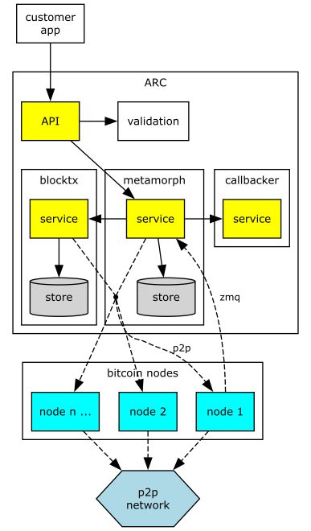
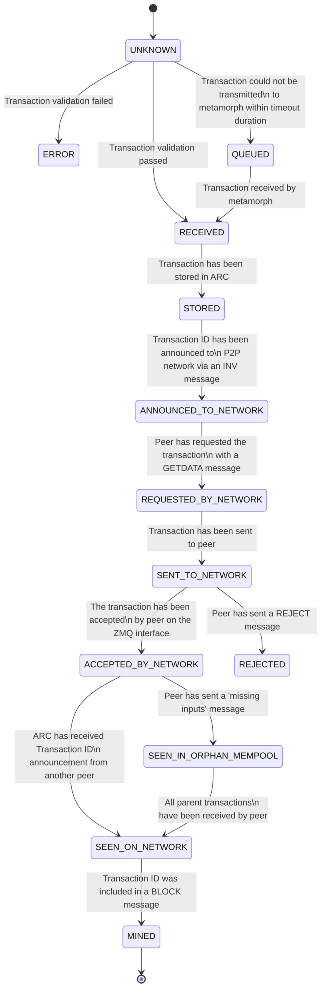
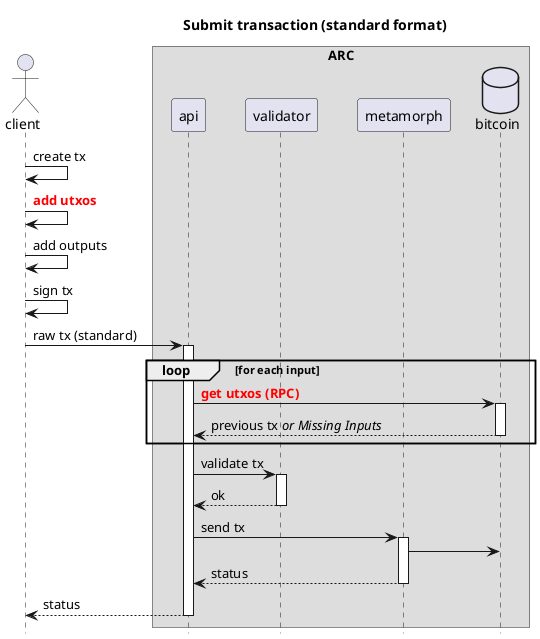
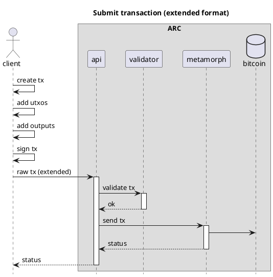
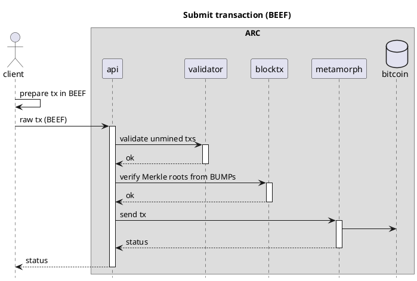
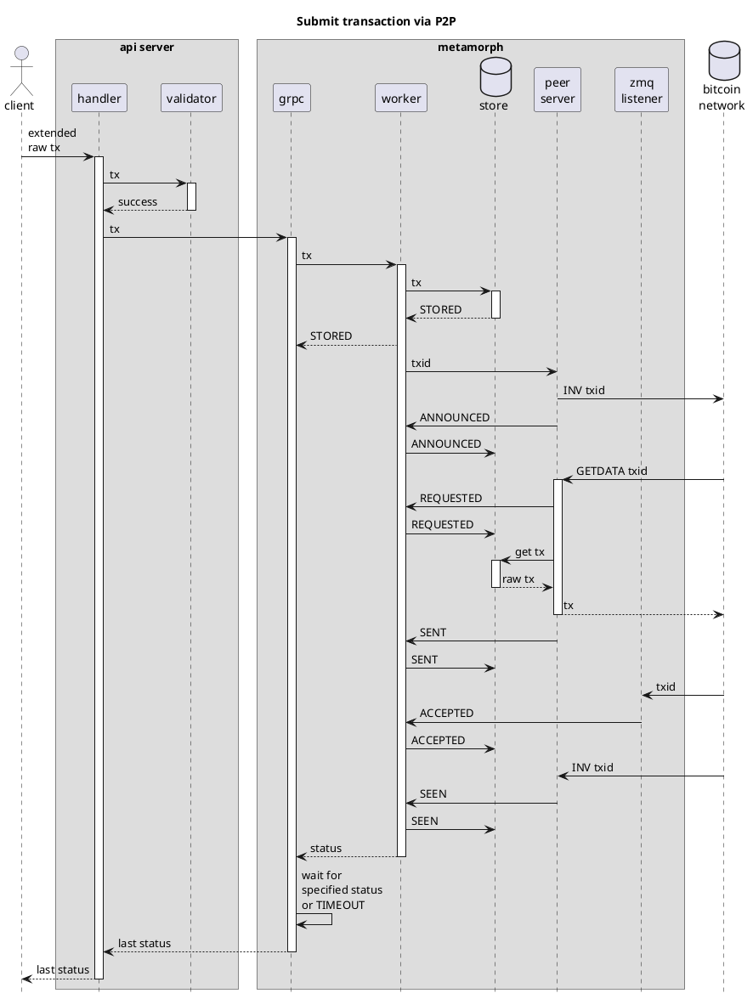
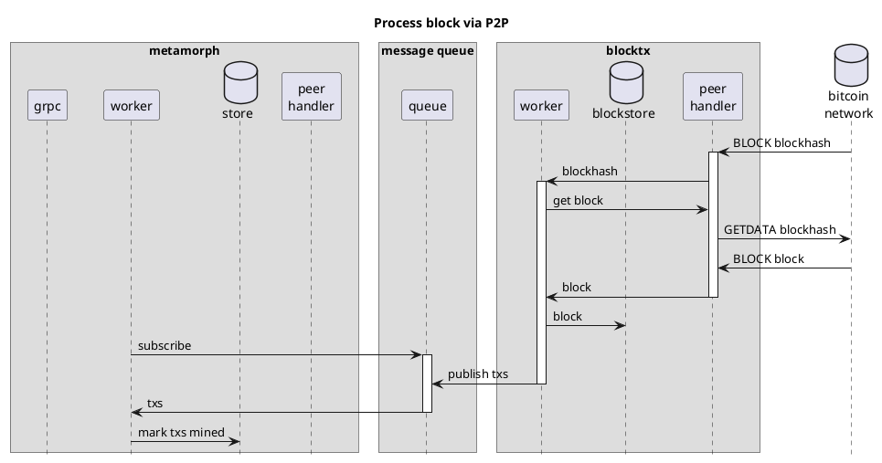

# ARC
> Transaction processor for Bitcoin

## Overview

**ARC** is a multi-layer transaction processor for Bitcoin that keeps track of the life cycle of a transaction as it is processed by the Bitcoin network. Next to the mining status of a transaction, ARC also keeps track of the various states that a
transaction can be in, such as `ANNOUNCED_TO_NETWORK`, `SEEN_IN_ORPHAN_MEMPOOL`, `SENT_TO_NETWORK`, `SEEN_ON_NETWORK`, `MINED`, `REJECTED`, etc.

Unlike other transaction processors, ARC broadcasts all transactions on the p2p network, and does not rely on the rpc interface of a single Bitcoin node. This makes it possible for ARC to connect and broadcast to any number of nodes, as many as are desired. In the future, ARC will be also able to send transactions using ipv6 multicast, which will make it
possible to connect to a large number of nodes without incurring large bandwidth costs.

The ARC design decouples the core functions of a transaction processor and encapsulates them as microservices with the ability to scale horizontally adaptively. Interaction between microservices is decoupled using asynchronous messaging where possible.

ARC consists of 3 core microservices: [API](#API), [Metamorph](#Metamorph) and [BlockTx](#BlockTx), which are all described below.

All the microservices are designed to be horizontally scalable, and can be deployed on a single machine or on multiple machines. Each one has been programmed with a store interface. The default store is postgres, but any database that implements the store interface can be used.



## Transaction lifecycle

The ARC architecture has been designed to assist in the management of the transaction lifecycle, enabling better tracking of the status of each transaction, reissuing transactions until they are seen by the network and notifying the issuer of relevant status changes. This ARC feature allows clients and bitcoin wallets to be lighter and more efficient in their mission.

ARC is a transaction processor for Bitcoin that keeps track of the life cycle of a transaction as it is processed by the Bitcoin network. Next to the mining status of a transaction, ARC also keeps track of the various states that a transaction can be in, such as `ANNOUNCED_TO_NETWORK`, `SEEN_IN_ORPHAN_MEMPOOL`, `SENT_TO_NETWORK`, `SEEN_ON_NETWORK`, `MINED`, `REJECTED`, etc.

If a transaction is not `SEEN_ON_NETWORK` within a certain time period (60 seconds by default), ARC will re-send the transaction to the Bitcoin network. ARC also monitors the Bitcoin network for transaction and block messages, and will notify the client when a transaction has been mined, or rejected.



## Microservices

### API

API is the REST API microservice for interacting with ARC. See the [API documentation](https://bitcoin-sv.github.io/arc/api.html) for more information.

The API takes care of validation and sending transactions to Metamorph. The API talks to one or more Metamorph instances using client-based, round-robin load balancing.

#### Validation

The API is the first component of ARC and therefore the one that by design derives a benefit for ARC performing a preliminar validation of transactions thanks to the use of the [extended transaction formats](#extended-format-ef-and-background-evaluation-extended-format-beef).

However, sending transactions in classic format is supported through the ARC API.

When possible, the API is responsible for rejecting transactions that would be unacceptable to the Bitcoin network.

### Metamorph

Metamorph is a microservice that is responsible for processing transactions sent by the API to the Bitcoin network. It takes care of re-sending transactions if they are not acknowledged by the network within a certain time period (60 seconds by default).

#### Callbacks

Metamorph also can send callbacks to a specified URL. To register a callback, the client must add the `X-CallbackUrl` header to the request. The callbacker will then send a POST request to the URL specified in the header, with the transaction ID in the body.

The following example shows the format of a callback body

```json
{
  "blockHash": "0000000000000000064cbaac5cedf71a5447771573ba585501952c023873817b",
  "blockHeight": 837394,
  "extraInfo": null,
  "merklePath": "fe12c70c000c020a008d1c719355d718dad0ccc...",
  "timestamp": "2024-03-26T16:02:29.655390092Z",
  "txStatus": "MINED",
  "txid": "48ccf56b16ec11ddd9cfafc4f28492fb7e989d58594a0acd150a1592570ccd13"
}
```

A callback token can be added to the request by adding the header `X-CallbackToken: <your callback token>`. The respective callback will then have a header `Authorization: Bearer <your callback token>`.

By default, callbacks are sent to the specified URL in case the submitted transaction has status `REJECTED` or `MINED`. In case the client wants to receive the intermediate status updates (`SEEN_IN_ORPHAN_MEMPOOL` and `SEEN_ON_NETWORK`) about the transaction, additionally the `X-FullStatusUpdates` header needs to be set to `true`. See the [API documentation](https://bitcoin-sv.github.io/arc/api.html) for more information.
`X-MaxTimeout` header determines maximum number of seconds to wait for transaction new statuses before request expires (default 5sec, max value 30s).

### BlockTx

BlockTx is a microservice that is responsible for processing blocks mined on the Bitcoin network, and for propagating
the status of transactions to each Metamorph that has subscribed to this service.

The main purpose of BlockTx is to de-duplicate processing of (large) blocks. As an incoming block is processed by BlockTx, Metamorph is notified about mined transactions by means of a message queue. BlockTx does not store the transaction data, but instead stores only the transaction IDs and the block height in which they were mined. Metamorph is responsible for storing the transaction data.

BlockTx also stores information about mined blocks, such as the Merkle roots, which are used in [BEEF validation process](#extended-format-ef-and-background-evaluation-extended-format-beef).

## Extended Format (EF) and Background Evaluation Extended Format (BEEF)

For optimal performance, ARC uses custom formats for transactions.

The first format is called the extended format, and is a superset of the raw transaction format. The extended format includes the satoshis and scriptPubKey for each input, which makes it possible for ARC to validate the transaction without having to download the parent transactions. In most cases the sender already has all the information from the parent transaction, as this is needed to sign the transaction.

The only check that cannot be done on a transaction in the extended format is the check for double spends. This can only be done by downloading the parent transactions, or by querying a utxo store. A robust utxo store is still in development and will be added to ARC when it is ready. At this moment, the utxo check is performed in the Bitcoin node when a transaction is sent to the network.

The second format is called Background Evaluation Extended Format, or BEEF, in short. BEEF was created to enable and facilitate Simplified Payment Verification (SPV) when sending transactions between peers which allows validation of transactions, the inputs of which may not yet be mined. Although this format is mainly used in peer-to-peer transactions, a peer ultimately has to submit the transaction to the nodes, and to help with that, Arc not only accepts that format, but also performs the SPV.

BEEF includes the transaction which constitutes the payment, as well as transactions whose outputs are used as inputs to the payment transaction (parent transactions) with their corresponding Merkle paths in the form of [BUMP](https://bsv.brc.dev/transactions/0074). In cases where the parent transaction is not yet mined, each ancestral transaction is included until the ancestor transaction is mined and has a corresponding Merkle path.

Arc validates each unmined transaction in BEEF in the same way it does an Extended Transaction. For each transaction with Merkle path (BUMP), the Merkle root is calculated and verified against [BlockTx](#BlockTx), which will prove that the Merkle roots provided are all part of block headers within the longest chain.

Storing all block headers is a very network-heavy process, therefore Arc stores information only about the most recent blocks and verifies Merkle roots against them. If an older Merkle root is included in BEEF, and everything else during the transaction validation checks out, the transaction is left to be validated by the nodes. The premise for that is twofold:
1. transactions are usually made from fresh UTXOs,
2. full SPV should also be performed in peer-to-peer transaction process (e.g. between SPV wallets), where at least one of the peers has an independent source of Block Headers indexed by Merkle Root.

### Extended Formats efficiency

With the successful adoption of Bitcoin ARC, these formats should establish themselves as the new standard of interchange between wallets and non-mining nodes on the network.

The Extended Format has been described in detail in [BRC-30](https://bsv.brc.dev/transactions/0030).
The Background Evaluation Extended Format has been described in detail in [BRC-62](https://bsv.brc.dev/transactions/0062).

The following diagrams show the difference between validating a transaction in the standard format, the Extended Format and BEEF:

#### Standard format flow


For each request ARC receives in standard format, it must request the utxos from the Bitcoin node. This is a slow process, as it requires a round trip to the Bitcoin node for each input.

For this reason it is expected that transactions come in an extended format or BEEF. Transactions in standard format require a pretreatment to convert each tx into extended format to pass through the ARC pipeline.

That pretreatment detracts from the expected efficiency of the process because it requires extra requests to the Bitcoin network. Therefore, it is expected that the trend will be to use the EF or BEEF, which may be the only supported formats in future.


#### Extended format flow


In contrast, the extended format allows the API to perform a preliminary validation and rule out malformed transactions by reviewing the transaction data provided in the extended fashion. Obviously, double spending (for example) cannot be checked without an updated utxo set and it is assumed that the API does not have this data. Therefore, the "validator" subfunction within the API filters as much as it can to reduce spurious transactions passing through the pipeline but leaves others for the bitcoin nodes themselves.

This [validation](#validation) takes place in the ARC API microservice. The actual utxos are left to be checked by the Bitcoin node itself, like it would do anyway, regardless of where the transaction is coming from. With this process flow we save the node from having to lookup and send the input utxos to the ARC API, which could be slow under heavy load.

#### BEEF flow



BEEF flow is very similar to Extended Format flow, with an additional step of Merkle roots verification in a call to blocktx. This step makes the whole validation process more thorough and allows for validation of transactions whose inputs are not yet mined without recursively asking the nodes for them.

## Settings

The settings available for running ARC are managed by [viper](github.com/spf13/viper). The settings are by default defined in `config.yaml`.

## ARC stats

ARC can expose a Prometheus endpoint that can be used to monitor the metamorph servers. Set the `prometheusEndpoint`
setting in the settings file to activate prometheus. Normally you would want to set this to `/metrics`.

## Client Libraries

### Typescript

A typescript library is available in the [@bsv/sdk](https://github.com/bitcoin-sv/ts-sdk) repository.

Please note that [arc-client-js](https://github.com/bitcoin-sv/arc-client-js) is deprecated.

## Process flow diagrams

The following diagram shows the process of how a transaction goes through the different statuses of the transaction lifecycle before it gets mined.



The following diagram shows the process of how a transaction finally gets updated to status `MINED`.



## Outcome in different scenarios

### Double spending

A transaction `A` is submitted to the network. Shortly later a transaction `B` spending one of the same outputs as transaction `A` (double spend) is submitted to ARC

Expected outcome:
* If transaction `A` was also submitted to ARC it has status `SEEN_ON_NETWORK`
* Transaction `B` has status `REJECTED`

The planned feature [Double spending detection](https://github.com/bitcoin-sv/arc/blob/main/ROADMAP.md#double-spending-detection) will ensure that both transaction have status `DOUBLE_SPENT_ATTEMPTED` until one or the other transactions is mined. The mined transaction gets status `MINED` and the other gets status `REJECTED`

### Multiple submissions to the same ARC instance

A transaction is submitted to the same ARC instance twice

Expected outcome:
* At the second submission ARC simply returns the current status in the response. Changed or updated request headers are ignored

The planned feature [Multiple different callbacks per transaction](https://github.com/bitcoin-sv/arc/blob/main/ROADMAP.md#multiple-different-callbacks-per-transaction) will allow that the same transaction can be submitted multiple times with differing callback URL and token. Callbacks will then be sent to each callback URL with specified token

### Multiple submissions to ARC and other transaction processors

A transaction has been submitted to the network by any other means than a specific ARC instance. The same transaction is additionally submitted to ARC

#### Transaction has already been mined

Expected outcome
* ARC returns a response with the status `ANNOUNCED_TO_NETWORK`
* The status will switch to `MINED`, including the respective block information and Merkle path.

#### Transaction has not yet been mined

Expected outcome
* ARC responds with status `ANNOUNCED_TO_NETWORK` or `SEEN_ON_NETWORK`
* At latest a couple of minutes later the status will switch to `SEEN_ON_NETWORK`

### Block reorg

A block reorg happens and two different blocks get announced at the same block height

Expected outcome:
* ARC does not update the transaction statuses according to the block in the longest chain.
* Information and Merkle path of the block received first will be persisted in the transaction record and not overwritten

The planned feature [Update of transactions in case of block reorgs](https://github.com/bitcoin-sv/arc/blob/main/ROADMAP.md#update-of-transactions-in-case-of-block-reorgs) will ensure that ARC updates the statuses of transactions. Transactions which are not in the block of the longest chain will be updated to `REJECTED` status and transactions which are included in the block of the longest chain are updated to `MINED` status.
