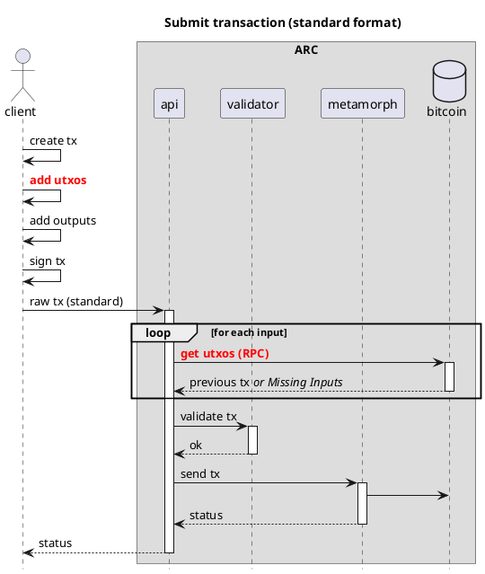
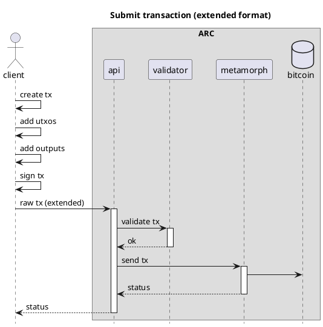
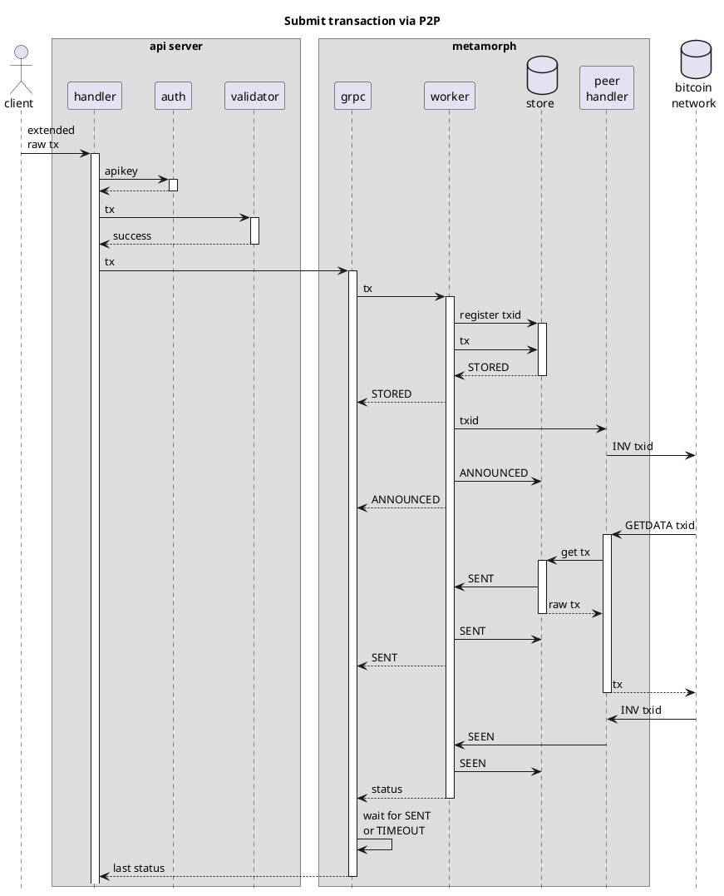
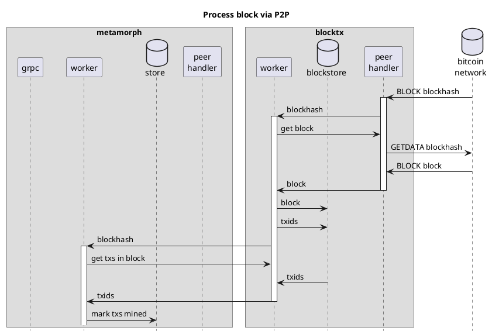

# ARC
> Transaction processor for Bitcoin

## Overview

ARC is a transaction processor for Bitcoin. It consists of four microservices: [API](#API), [Metamorph](#Metamorph), [BlockTx](#BlockTx) and [Callbacker](#Callbacker), which are all described below.

All the microservices are written in Go, and use grpc and protobufs for internal communications.

All the microservices are designed to be horizontally scalable, and can be deployed on a single machine or on multiple machines. Each one has been programmed with a store interface and various databases can be used to store data. The default store is sqlite3, but any database that implements the store interface can be used.

## Extended format

For optimal performance, ARC uses a custom format for transactions. This format is called the extended format, and is a superset of the raw transaction format. The extended format includes the satoshis and scriptPubKey for each input, which makes it possible to validate the transaction without having to download the parent transactions.

The extended format has been described in detail in [BIP-239](BIP-239).

## Settings

## Microservices

The microservices are described in detail below.

### API

API is the REST API microservice for interacting with ARC. See the [API documentation](api) for more information.

The API takes care of authentication, validation, and sending transactions to Metamorphs.

### Metamorph

Metamorph is a microservice that is responsible for processing transactions sent by the API to the Bitcoin network. It
takes care of re-sending transactions if they are not acknowledged by the network within a certain time period (60
seconds by default).

Metamorphs are designed to be horizontally scalable, with each instance operating independently and having its own
transaction store. As a result, they do not communicate with each other and remain unaware of each other's existence.

#### Metamorph stores

The metamorph store has been implemented for the following databases:

* Sqlite3 (`sqlite` or `sqlite_memory` for in-memory)
* Postgres (`postgres`)
* Badger (`badger`)
* BadgerHold (`badgerhold`)

You can select the store to use by setting the `metamorph_dbMode` in the settings file or adding `metamorph_dbMode` as
an environment variable.

### BlockTx

BlockTx is a microservice that is responsible for processing blocks mined on the Bitcoin network, and for propagating
the status of transactions to all Metamorphs connected to the server.

#### BlockTx stores

### Callbacker

Callbacker is a very simple microservice that is responsible for sending callbacks to clients when a transaction has
been accepted by the Bitcoin network. To register a callback, the client must add the `X-Callback-Url` header to the
request. The callbacker will then send a POST request to the URL specified in the header, with the transaction ID in
the body. See the [API documentation](#API) for more information.

#### Callbacker stores

## Client Libraries

### Go

WIP

### Javascript

WIP

## Process flow diagrams

